## Tutorial 2: Mapping Data

With this exercise, you will learn introductory skills involved in using QGIS to map existing spatial datasets. After the completion of this set of three Mapping Data exercises, you should have:

1. Become familiar with the QGIS user interface
2. Learned the components of shapefiles
3. Created a clear and effective map composition
4. Critically considered symbology and classification and the differences between mapping qualitative and quantitative information
5. Created and calculated new fields in an attribute table
6. Performed a table join to combine additional data to an existing shapefile’s attribute table
7. Queried a GIS dataset, using both tabular queries and spatial queries
8. Worked with projections and examined the impacts of projection transformations on spatial analysis

### Part 0
Download the GitHub repository for this course. Using the green button [here](https://github.com/CenterForSpatialResearch/mapping_architecture_urbanism_humanities/), select `Download ZIP`. The `Data` folder will then have all of the datasets needed for tutorials.

Find instructions for installing QGIS [here](01_QGIS.md).

### Part 1: Mapping World Population(s)
#### Premise
We are interested in creating a map of world countries and cities (and at the same time exploring the QGIS interface). We have a point file for the locations of populated places around the world as well as a polygon file for country boundaries. This map will serve as a basemap to which we can add additional information and layers in order to examine multiple measures of population and the differences between them.

#### Setting up QGIS

**Launch** QGIS. Your new blank map project will look like this:

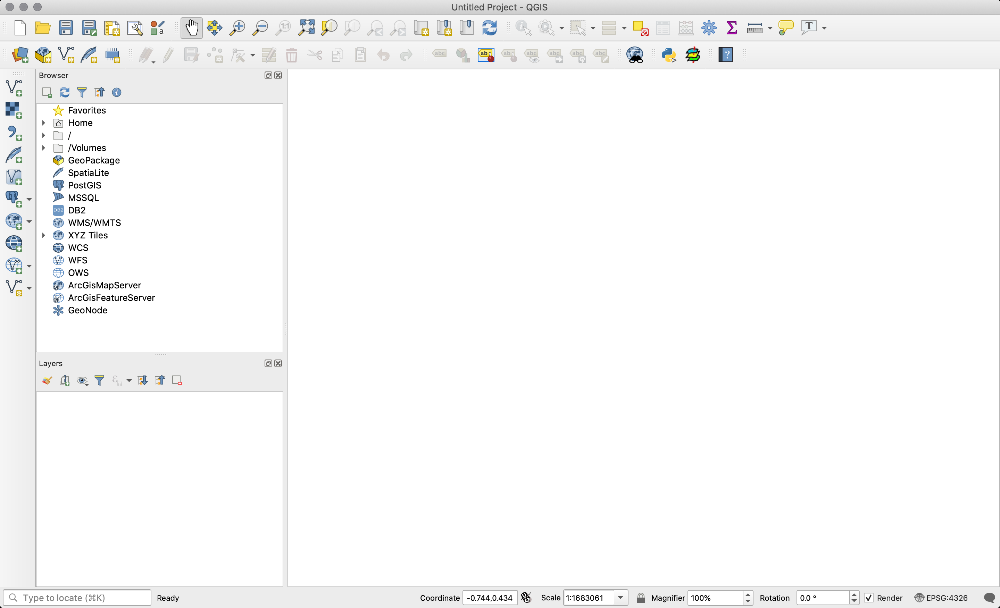

Begin to familiarize yourself with the interface. You can also refer to this [brief description](https://github.com/CenterForSpatialResearch/MappingForTheUrbanHumanities/blob/master/Resources/QGIS_InterfaceDescription.md) of the elements of the interface for more information.

#### Adding Layers

In order to construct our map within QGIS we will need to add our data layers to the map project. There are several ways to accomplish this however we will begin by using the `Add Vector Layer` button.

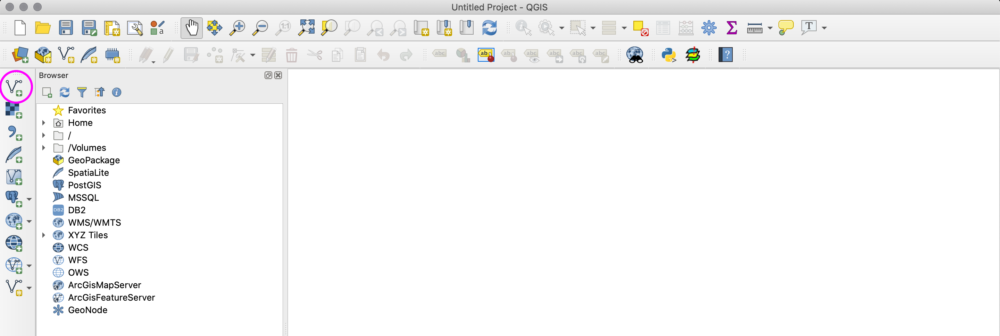

**Navigate** to the `Data/2_MappingData/Shape` folder. You'll notice a number of different file extensions that are likely unfamiliar. The files outlined in blue are all components of the admin_0_countries shapefile, and the ones outlined in magenta are all elements of the populated_places shapefile. It is very important that all of these files stay together in the same folder otherwise QGIS will not be able to load the layer.

* .shp - The main file that stores the feature geometry (required).
* .shx - The index file that stores the index of the feature geometry (required).
* .dbf - The dBASE table that stores the attribute information of features (required).
* .sbn and .sbx - The files that store the spatial index of features (these might get corrupted, see note at the end of this tutorial).
* .prj - The file that stores the coordinate system information.
* For more information on these extensions and others see [this explanation by ESRI](http://webhelp.esri.com/arcgisdesktop/9.2/index.cfm?TopicName=Shapefile_file_extensions).

Add the `populated_places.shp` and `admin_0_countries.shp` files. Even though we will just be adding these files to the map QGIS still references the other files associated with each layer (.shx,.dbf,.sbn,.prj).
Note you can select multiple shapefiles by holding down Command (on Mac) or Ctrl (on Windows) while individually clicking the file names.
The selected layers will be added in default colors.

The cities layer is represented by points and the countries layer is represented by polygons. The order of the layers can be controlled with the `Layers panel` to the left of the Data Frame.

**Click** and drag the admin_0_countries layer on top of the populated_places layer. The cities points are no longer visible because they are behind the countries polygons (or only visible at the borders of the countries and the oceans).

We can change this by removing the fill color of the country polygons, leaving only the outline of their boundaries. To do this, we must change the style of the data layer. That is, we will change the way the data is styled or symbolized on the map. The simplest style for any dataset is to apply a single symbol to every feature within the layer.

We will display the countries as just borders. To access the `Style Menu` **double-click** on the layer name in the Layers panel, or **right-click** on the layer name and select `Properties.`  There are many different ways to symbolize data on a map through QGIS. For now, we will just use one style for all of the features in the layer.

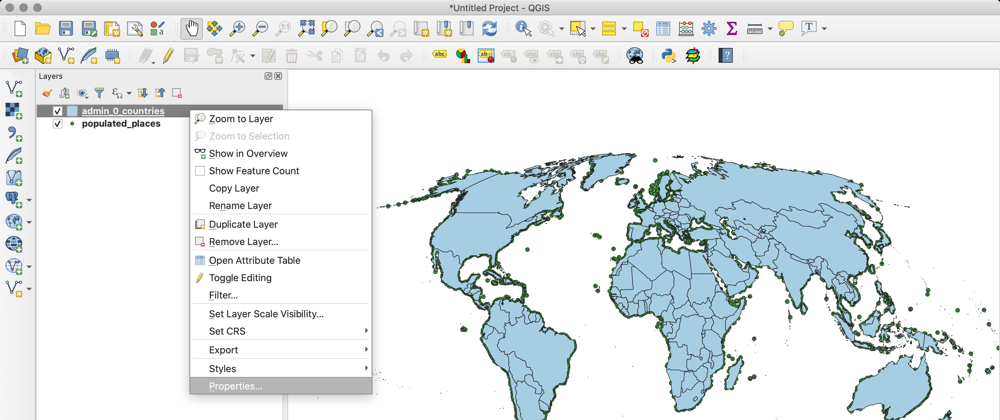

Once inside the Layer Properties Menu **select** the `Style` tab. **Select** `Simple Fill` and then in the `Symbol layer type` menu **select** Outline: Simple line.

When your style settings are finished, **click** `OK` to exit the properties menu. You should now be able to see each of the populated places points through the empty country polygons.

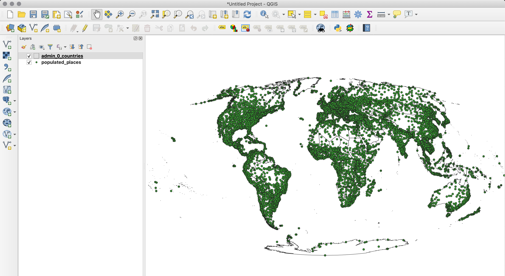

**Save** your QGIS project by selecting `Project` > `Save`. Name your project MappingData_Population.qgs. QGIS projects are saved as `.qgs` or `.qgz` files; make sure `.qgs` is selected in the file type dropdown. It is important to note that the data layers are not saved with it the map project but are rather linked to the project.

### Part 2: Mapping World Population(s) to understand the difference between multiple methods of measuring world population

#### Premise

We will work with the basemap we made in Part 01 and add new data to it in order to examine multiple measures of world population. We will examine population aggregated to cities and countries and a raster dataset that depicts the distribution of world population at a resolution of approximately 1km.

We have already mapped the locations of populated places (which contains population estimates collected using [LandScan](http://web.ornl.gov/sci/landscan/)) as well as country polygons. We also have tabular data available for population at the country level from the [United Nations](http://esa.un.org/unpd/wpp/Download/Standard/Population/) which we will join to the country polygons, as well as a raster layer that describes world population in 1km grid created by CEISIN. We will answer questions about the differences between the depictions of population at the city, country, and 1km scale.

#### Notes on the data:

The Gridded Population of the World describes the distribution of population across the planet and is not explicitly linked to geopolitical boundaries. It is created by Columbia’s Center for International Earth Science Information Network (CIESIN) through compiling census surveys from all over the world. You will be prompted to download a version of it in the Mollweide projection (more on projection systems later...) in the next section. The original data is downloadable [here](http://beta.sedac.ciesin.columbia.edu/data/set/gpw-v4-population-count/data-download), the data is free to download however you will need to create an account to access it.

The data we are using about populated places is aggregated by [Natural Earth v. 2.0](http://www.naturalearthdata.com/downloads/10m-cultural-vectors/10m-populated-places/), the population estimates included in the point file are gathered using [LandScan](http://web.ornl.gov/sci/landscan/) which uses satellite imagery and sophisticated (but some say flawed) algorithms in order to model world population.

Country-level population data was published by the [United Nations Population Division](http://esa.un.org/unpd/wpp/Download/Standard/Population/) in 2010. All figures are reported in thousands, i.e., if the population field says 7,000 in the dataset this equals 7,000,000 inhabitants. We have provided a cleaned version of this dataset but the original can be downloaded [here](http://esa.un.org/unpd/wpp/Download/Standard/Population/).

#### Downloads
In addition to the data files you have downloaded already you will need to download the Gridded Population of the World raster dataset [here](https://drive.google.com/file/d/0B5KywkNXsT4JYlZGd1lReUVyYVk/view?usp=sharing). Please create a new folder in your `Data/2_MappingData` directory called `Raster` and save the `GriddedPop.zip` file there. Once it has downloaded unzip the file so that we can use its contents.

#### Setting up QGIS
Open your MappingData_Population.qgs file.
It should still contain the countries polygons and populated places points we added previously. (*Note* if these layers are not immediately visible then **right click** on the name of either layer in the `Layer` menu and click `Zoom To Layer`). We will first add CEISIN’s Gridded Population of the World to our map project. Then we will add a tabular data file containing population by country for 2010. This is the information we will join to the countries polygons.

**Select** the `Add raster layer` button in order to add the CEISIN’s Gridded Population of the World raster layer.

Then in the dialog box which opens browse to the `Data/2_MappingData/Raster` folder and select `gpw_v4_2010.tif`. We will speak about the qualities of raster datasets a bit more later but for now let’s just add it to the map. After you’ve added this layer you can **un-click** the box next to the layer name in int Layers menu in order to toggle the visibility of the layer off.

Now we will add the table that describes population by country which we will join to the country polygons in order to be able to examine country level population values spatially.

**Select** the `add delimited layer` button.

Then in the dialog box which opens browse to the `Data/2_MappingData/Tabular` folder and **select** `TotalPopulation_Countries.csv`.
**Select** `CSV` as the File Format. And **select** `no geometry (attribute table only)` as the Geometry Definition. **Click** OK.

You'll notice TotalPopulation_Countries has been added to the Layers menu. Because it is just a table and does not have any geometry it does not show up in our map view. Let's open up its attribute table to see the fields that it contains before we embark on joining it to our country polygons. It contains three columns (or fields): `Country_Code`, `Name`, and `Pop_2010`.

#### Performing a Table Join
In order to answer questions about world population by country we will join tabular data published by the United Nations to the country polygons we have already mapped. A table join allows GIS users to combine tabular data with vector data based on an identical field in their attribute tables.  

We have already cleaned the `TotalPopulation_Countries.csv` file and removed additional rows included in the original dataset that we will not need for our purposes here. In addition, we have abbreviated the column names and reformatted them so that they can be read by QGIS. In future exercises we will cover in depth how to clean, format, and save data so that it can be read by QGIS.  

**Right-click / Control-click** admin_0_countries in the layer menu and select `Open Attribute Table`. The layer’s attribute table will appear. This describes the data associated with each feature in the feature class.

In order to join attributes from a table to a shapefile the two data sets must share a common attribute field.
Let's review the fields in the attribute table for the admin_0_countries layer:

They are:
* NAME, NAME_LONG: a text name for the admin 0 area or country
* ISO_N3: the unique three digit code assigned to each country by the International Organization for * Standardization (ISO).
* REGION_UN: a text name for the UN designated region the country lies within.
* SUBREGION: a text name for the UN designated subregion the country lies within.
* Cnt_Code: a unique code assigned to each country, that matches the ISO code but without preceding zeros.

Let’s review the column names in the TotalPopulation_Countries.csv file. **Open** the attribute table in the same way we just opened the attribute table for the admin_0_countries layer.
* Country_Code: a unique numeric code corresponding to each country
* Name: text name for the country
* Pop_2010: estimated population of country in 2010

Note that the Country_Code is identical to the Cnt_Code for each country, and each is unique -- no two countries have the same ISO_N3 number. This unique field common to both datasets is what allows us to join the tabular population data to the vector file describing the geometry of those countries.

We always start the join on the file that we are joining to. Here, we are joining the population estimates table to the country boundary shapefile. Thus, Open the Properties for admin_0_countries, and navigate to “Joins” in the left hand menu. Click the “+” icon. Make the following selections in the dialogue box which appears.

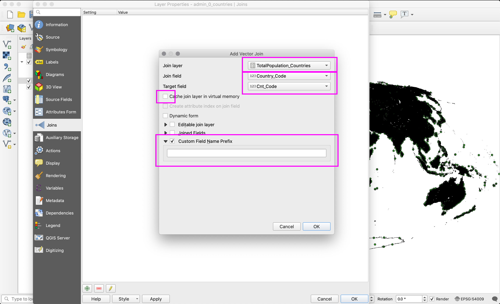

**Select** TotalPopulation_Countries as the “join layer”, Country_Code is the “join field”, and Cnt_Code is the “target field” which matches the join field in the admin_0_countries layer. Select the box next to “Custom field name prefix” and delete the contents of that field (note this is a helpful field if we are joining data from many different tables to one shapefile as it allows you to distinguish the source table). **Click** `OK` to close the join dialogue. Then **Click** `OK` to close the layer properties menu.

Open the attribute table for the countries shapefile. You’ll notice two new fields have been joined to the right hand side of the table: `Name` and `Pop_2010.`

Note: the population estimates data that is joined to the country boundaries is not permanently associated with its attribute table. Instead the relationship only exists within this QGIS project. If we added the admin_0_countries layer to another QGIS project the fields we have joined from the population estimates would not be there.

In order to permanently incorporate the population estimates into a shapefile of world countries we must save a new version of the shapefile. **Right-click / Control-click** on admin_0_countries in the layers menu and select `Export > Save Features As...`. Select `ESRI Shapefile` as the format, and save your file in the `Data/2_MappingData/Shape` folder as `admin_0_countries_UNPop.shp`.

This new layer will then be added to the map and will contain the population estimates that we joined from the UN tabular data.

#### Attribute Tables and Data Querying

Now that we have assembled these data layers we can begin to ask a few simple questions about the different measures of world population that each depicts. We will accomplish this by querying the attribute fields of our two vector layers, the populated places and the countries. To do this we will select features using an expression which is sometimes referred to as Select by Attributes. In addition we will use

We will answer a few questions:
* How many cities have populations of greater than two million people?
* How many countries have populations of less than seven million people?
* How many cities with more than two million residents are within countries where the total population is less than seven million?

In order to answer these questions we’ll first select just those cities from the `populated_places` layer which have populations of more than two million. Then we will export that as a separate layer. Then we will do the same for countries which have populations of greater than seven million people, and also less than seven million.

There are multiple routes to select features within a dataset, either we can open its attribute table and select `Select features using an expression` or we can navigate to `Edit > Select > Select Features by Expression...` option. (The same icon should show up as a new shortcut button in your toolbar once you have performed this action once.)

Option 1:

Option 2:

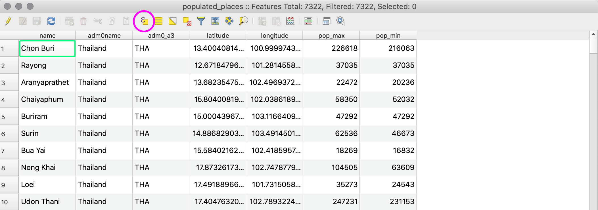

Either route will open the `Select by Expression` tool. We can be sure we are selecting features from the correct layer from the header of this dialogue box. We see that the header reads “Select by expression - populated_places” and because we will select the cities first we know we are selecting features from the correct layer.

If we click on any of the terms in the central box (highlighted in magenta) a description of it will appear on the right side (highlighted in blue). We will combine the field name with other operators which we will find in the magenta box in order to build an expression in the green box on the left side.

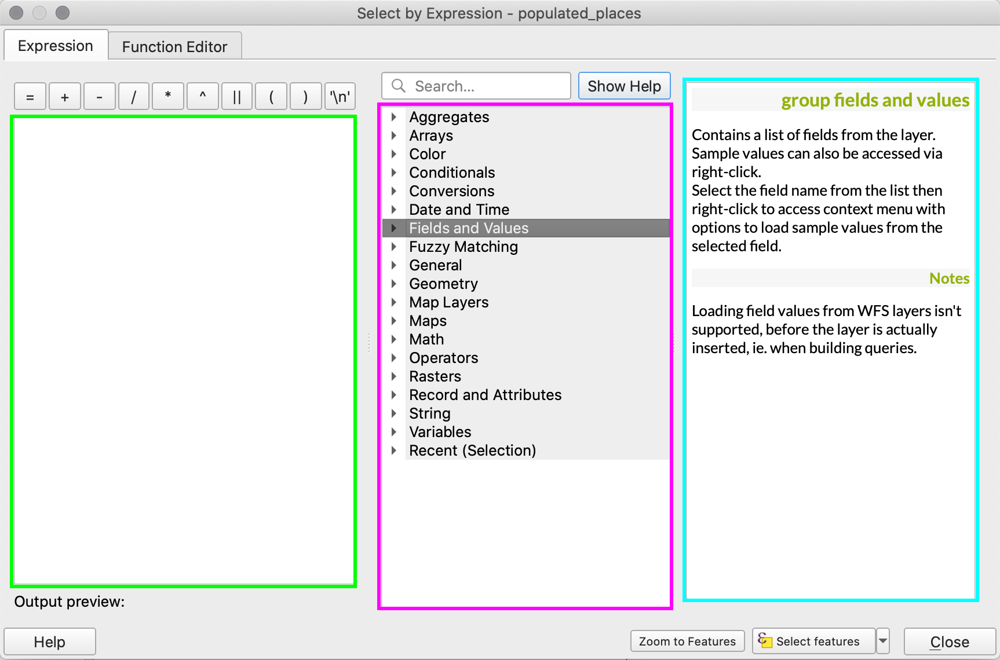

We want to select just those cities with a maximum estimated population of greater than two million.

To do this we will expand `Fields and Values` and select `pop_max`.
* **Double-click**  on `pop_max` and it will appear in the expression box on the left.
* Next we will open `Operators` and double-click on the greater than symbol (>).
* Then type in 2,000,000. Your expression should now look like the following.

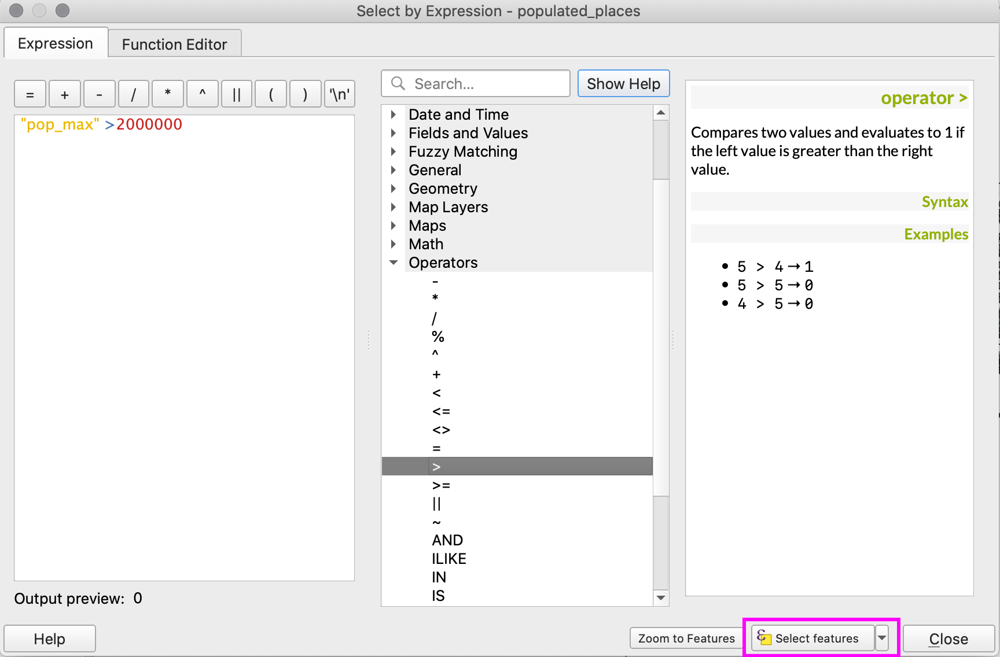

* **Click** `Select`.

You should notice that some of the populated_places points will turn yellow. In addition at the bottom left corner of your QGIS project the footer will tell you how many features were selected: we see that 215 cities were selected.

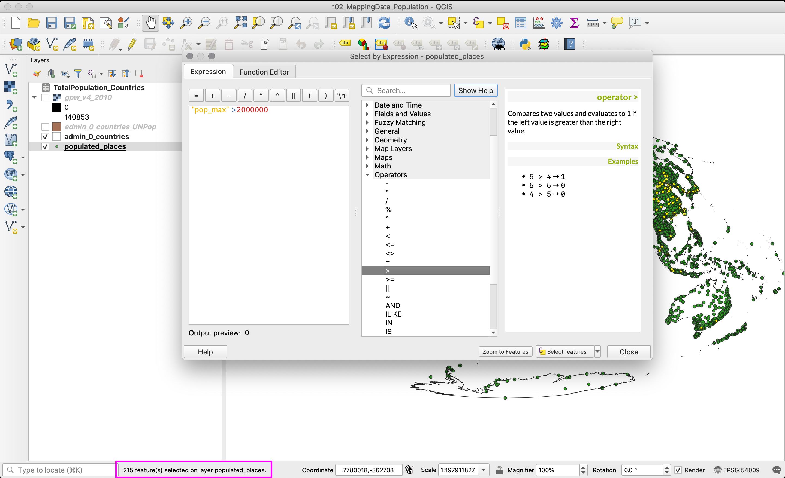

We will now save those 215 cities as a separate shapefile, just like we did for the admin_0_countries layer after we joined the UN population estimates to it.

* **Right-click / Control-click** populated_places in the Layers menu, **select** `Export > Save Features As`.
* Then in the dialogue box which opens select `Save only selected features`, and save the shapefile in `Data/2_MappingData/Shape` as `populated_places_2mil.shp`.  
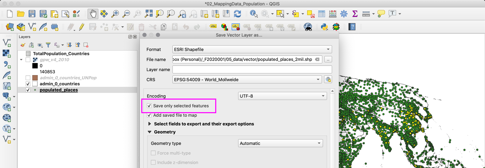

* This will then be added to our map as a new layer. In order to see the new layer clear your selection by clicking the `Deselect features from all layers button.`

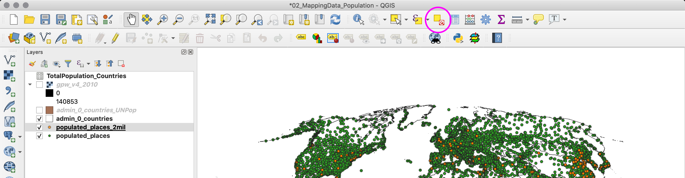

#### Select by location

As we outlined above  we are interested in finding out how many countries have fewer than seven million inhabitants, and then how many cities with over two million inhabitants fall within those boundaries.  In order to answer these two questions we will need to perform a spatial query by layering these two datasets rather than merely querying within the attribute table of one dataset.

* **Open** the attribute table for admin_0_countriesUNPop and select the `select features using an expression` tool. We will again select by expression in order to select the countries with fewer than seven million inhabitants. Use the expression builder as we did above with the populated places in order to select the countries with fewer than seven million inhabitants. Remember the dataset is expressed in thousands thus 7,000,000 will appear in the data as 7000.
* Your expression should read:  `"Pop_2010"  < 7000`

The header bar of the attribute table will indicate that 124 of 238 features were selected.

Now, we will use this selection to identify which cities of greater than two million people are within countries with fewer than seven million people. To do this we will use the select by location tool.
* On the menu bar navigate to `Vector`>`Research Tools`>`Select By Location`. In the dialogue box that opens make the following selections (make sure that `Selected features only` is checked):

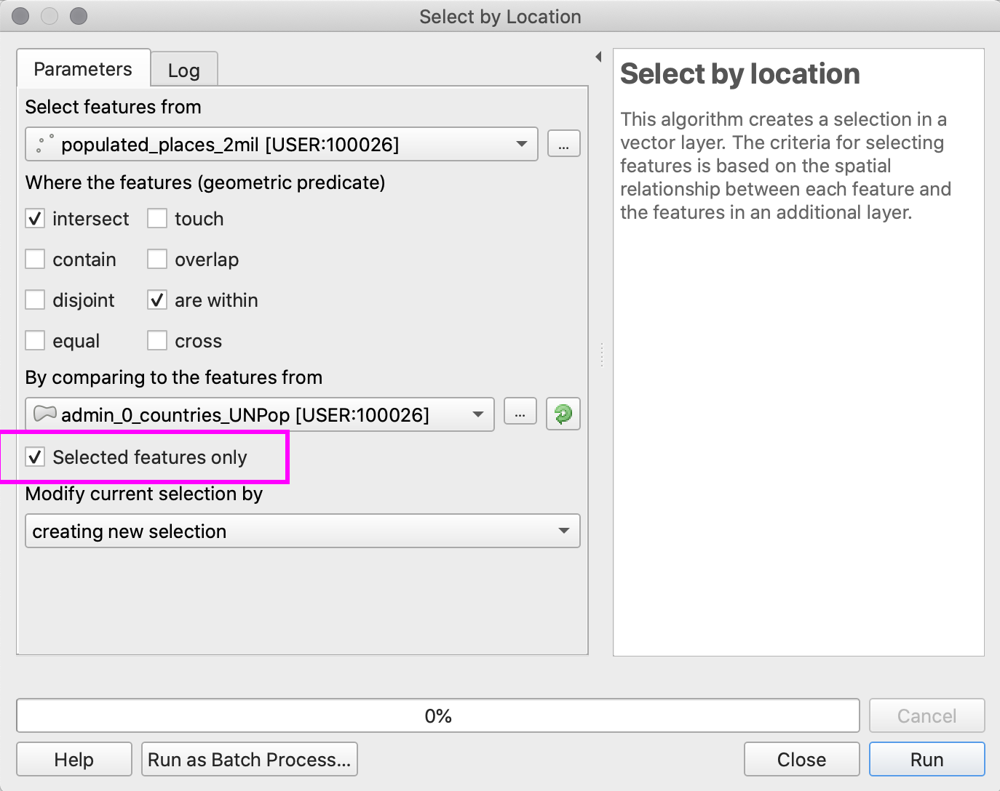

In the bottom left hand corner of your QGIS window you will see that five populated places were selected. Open the populated places attribute table and identify which cities these are by choosing `Show Selected Features` from the dropdown menu at the bottom left of the window.

Now use select by attributes and select by location to answer the following question:
* How many countries contain cities with greater than 7 million inhabitants?

Include the answer as part of your map composition that we will review on Tuesday.   

#### Symbolizing World Populations

Now that we have these three different layers we can begin to create maps that highlight the differences between these different ways to measure population. We will compose a map that symbolizes each of our three data layers differently. We will use graduated symbols to express city population, a choropleth map for population by country and a classified color ramp for the gridded population. We will then go over cartographic conventions adding a legend and scale bar to the map and exporting as a PDF.

**Proportional  symbols**

We will symbolize the cities layer with symbols that are sized proportionally to their population -- a city with a larger population will have a larger circle and visa versa.
To do this open the layer properties menu for the `populated_places` layer and navigate to the Style tab.

Choose Graduated Symbols. Select `pop_max` as the column, `Size` for the method, and `Natural Breaks (Jenks)` as the mode. Click `Classify` and then click `Apply`. The populated places will now be sized according to their population.

Now switch the method to `Color` and observe the results.

**Bonus**: What if you want both color _and_ size? Once you've symbolized based on color, click on Symbol 'Change' and then on 'Simple Marker.' Next to the size option, there is a small icon. Select 'Size Assistant'.

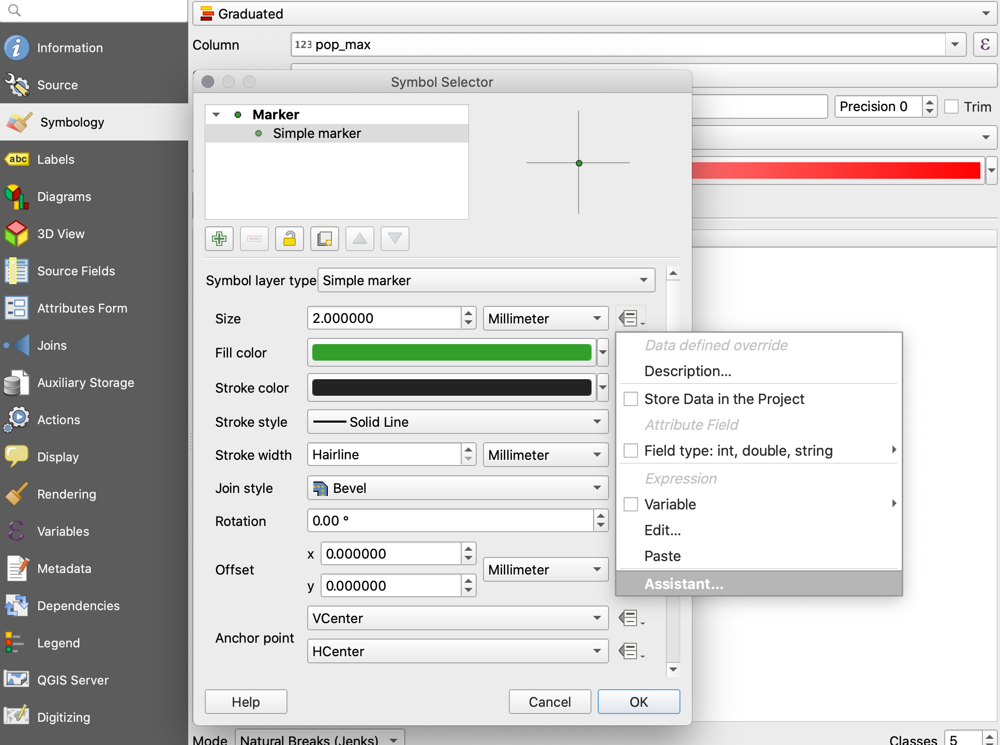

In the pop up box, select the pop_max filed and Flannery classification

The outcome of your selections should look something like this:

**Raster Classified Color Ramp**

Next we will symbolize our gridded population of the world layer. This layer is different from the ones we have been primarily working with thus far because it is a raster dataset.

A raster is a data layer that is composed of a grid of cells, or pixels, of a specific size where each cell has a value that represents information. In our case each cell has a value for population. Unlike a vector data layer which has an attribute table and each point, line or polygon can have multiple values associated with it, a raster grid cell can only have one value. Examples of other types of raster datasets include, temperature gradients, satellite images, and scanned historical maps.

If it isn’t already check the box next to the gridded population layer, gpw-v4-population-count-2010, to make it visible if it is not the top layer drag it in the Layers menu so that it is the top visible layer. It will largely be black. Now open the properties menu for the gridded population layer. Navigate to the style tab. You’ll notice that this looks different than the style menu we have been working with for our vector layers. Instead of a symbol type we have an option for ‘Render type’ and many options for how to color the bands in our dataset.

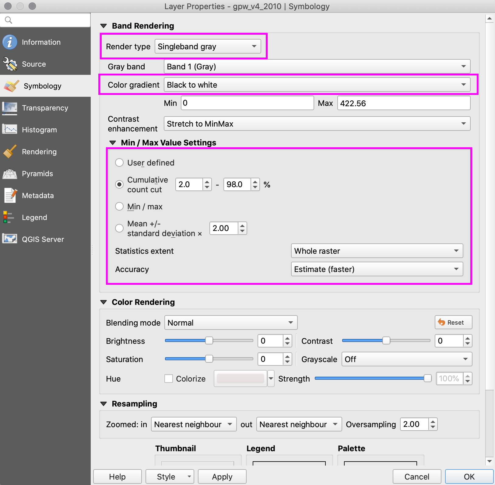

Here you will see that the default style is `Singleband gray`, which means that it's only symbolizing in grayscale based on one band (other raster datasets can be made up of multiple bands, some examples of these include satellite images and color historical maps). The color gradient is currently set as `Black to white` but that can be switched to `White to black`.

And it is symbolizing based on the minimum value, in this case '0' and on the maximum value, '422.56'. Now, that's not actually the maximum value of the raster dataset. If you look at the right-hand panel (`Load min/maxvalues` highlighted in blue), which is where the min and max values come from, you will notice that the min/max values are being calculated based on a `Cumulative count cut`, which is used to get rid of the outliers. The Cumulative count cut means that QGIS is only taking into account the values between 2% and 98%, in the default cases. You could change that and use the option Min / max to use the actual minimum and maximum values. If you choose this one, you have to click on the Load button to load the new values. Do this and click on `Apply` to see how the image changes. Now the minimum is still '0' but the maximum is '140853'. Because of this new maximum value, most of the image appears black.

Now change the `Render type` to `Singleband pseudocolor` to get something similar to a symbology we would do for a vector file. On the right-hand panel you will see the `Mode of classification` (`Continuous` or `Equal Interval`) and below, again, the Load min/max values panel. Click on the `Classify` button to load the values and then hit `Apply` to see it on the map. Now you can see clearly the regions of the world with the highest population density. You can experiment with the style of your map by changing the colors used with the pulldown menu highlighted in blue.

**Choropleth**

Create a choropleth map for population by country, where each country is  colored according to its population size.

**Open** the properties for the admin_0_countriesUNPop layer and navigate to the Style tab. Select Graduated Symbols from the dropdown at the top left, and select Pop_2010 as the Column on which we will color the map. Then in order to change the color of the entire country polygon we will need to change the symbol from an outline to a filled polygon by clicking the Change button next to Symbol and selecting “simple fill.” Next we will break up our data into classes, or ranges of values, and classify the colors for our choropleth map according to these.

Experiment with different modes and numbers of classes. What argument does each option convey?

After selecting each combination **Click** `Classify`.  Click `Apply`. The country polygons will change on the map.

#### Designing a map
In order to present these three types of population measures we will now compose a map layout and become familiar with the QGIS map composer. The map composer allows you to add a legend, north arrow and scale bar to the map as well as to export our work as a PDF.

Create a map composition where all three depictions of world populations are values. Experiment with changing the colors of the different layers to become more familiar with the style menus for raster and vector layers. You can adjust the transparency of your data layers using the style menu.

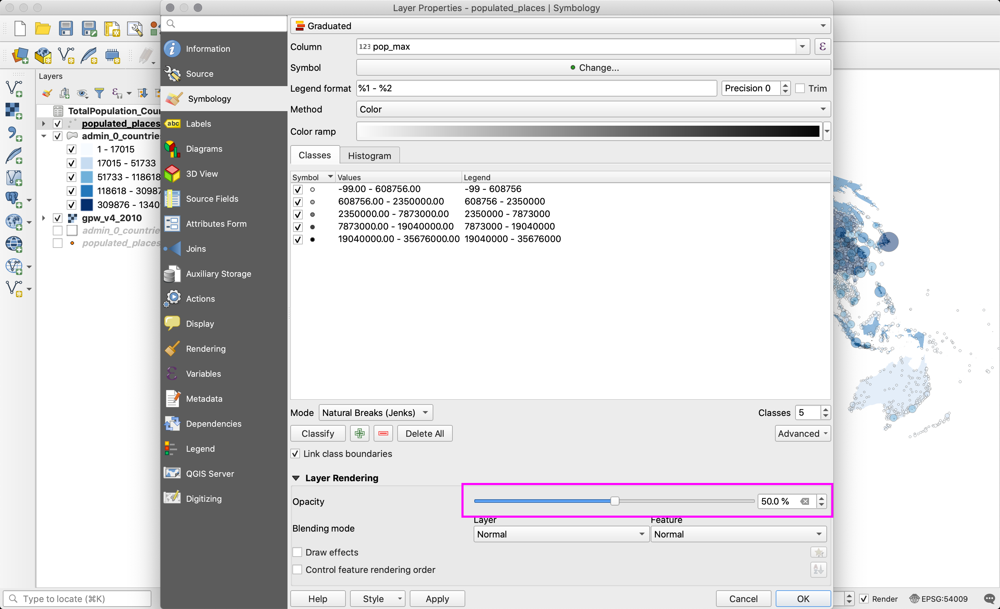

Once you are pleased with your map composition we will create a new print composer. When prompted you can either name the print composer or not.

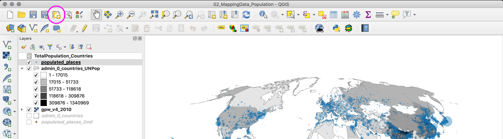

To add a new map to the composer select the add new map button. Then click once to begin to drag a rectangle over the area on the page that you would like the map to occupy and click again to stop. Whatever is showing in your QGIS map project window as you create this new map in the print composer is what will appear in the new map.

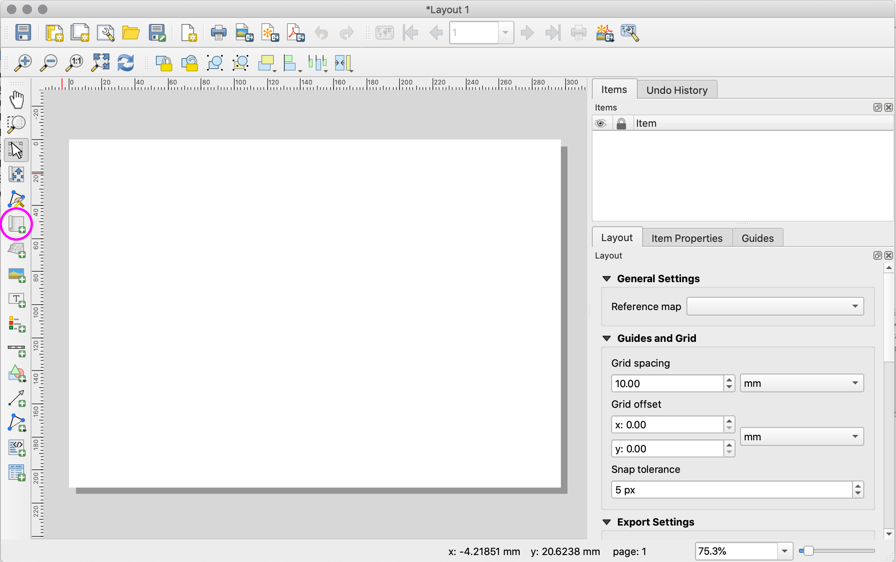

Next we will add a legend. Select Add new legend, and again click to draw a rectangle where you would like to place the legend. An unformatted legend that matches the information from the Layers panel will appear. You can use the options in the Item Properties tab (circled in blue) to change which layers are represented in the legend and to change the labeling of the layers in the legend. Scroll within this tab to familiarize yourself with which properties about the legend you can change.

We will format the legend and change the titles of each dataset so they are more descriptive. To do this un-click “Auto update” to make changes, then change the layer names by clicking the “legend item properties” button circled in magenta.

Next we will add a scale bar. Click the add new scale bar button. Again you will be able to change the properties of the scale bar, including the style, number of segments and size.

Last we will add two text boxes, one with a title for the map and another with abbreviated citations for our data sources. Click the add new label button then use the Main properties field to add the text you want, and use the Font button to change the text size and font.

Finally use one of the export options circled in blue above to save the map composition as an image file, PDF, or SVG.

* Make this map composition your own – experiment with changing colors, and symbol sizes and the locations of the text and scale bars. The aim is to create a design that you are pleased with, that is clear, and follows cartographic conventions.

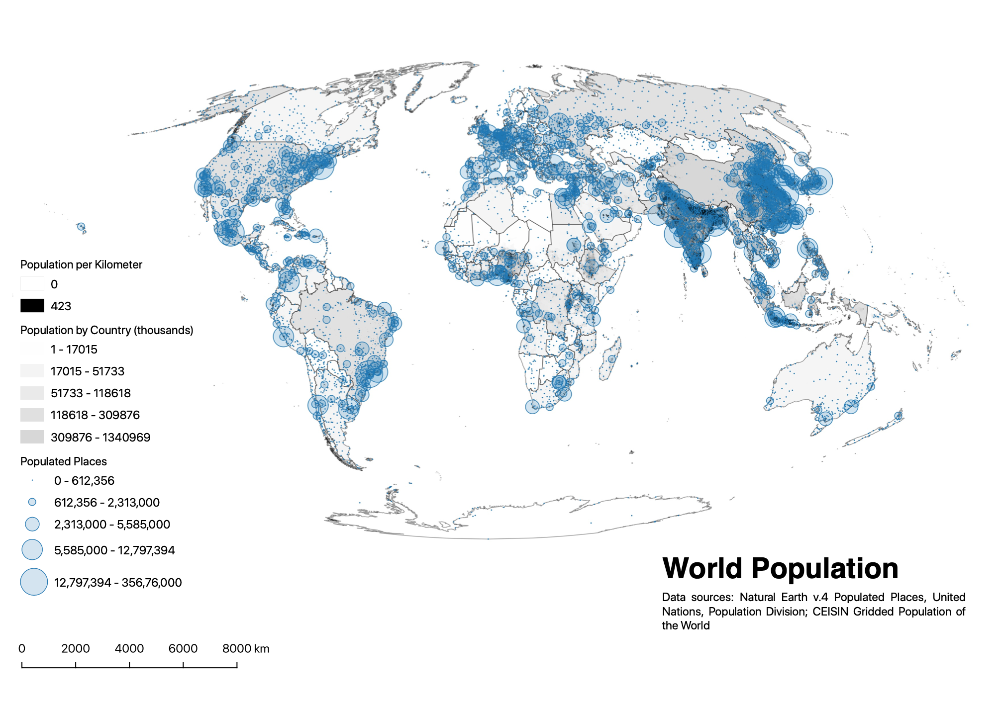

### Deliverables:

Post your finished map composition (as a pdf or jpeg) to canvas under the Tutorial 02 assignment.

Include your answer to the following question you answered on your own:
* How many countries contain cities with greater than 7 million inhabitants?

______________________________________________________________________________________________________________

Tutorial written by Dare Brawley, for *Mapping for the Urban Humanities*, a intensive workshop for Columbia University faculty taught in Summer 2017 by the [Center for Spatial Research](http://c4sr.columbia.edu). Edited by Emily Fuhrman for Spring 2020. 
