## Tutorial 4: Census Data

Census data is often one of the most mapped datasets, and there are good reasons for this: not only does it provide insights about our current living conditions in the US, like income, race, age, employment or commuting patterns, but it also serves as the backdrop for many other kinds of data. Without population data, for example, we wouldn't be able to 'normalize' cellphone usage or crimes, and without median household income or race patterns we wouldn't be able to identify social justice problems, like concentrations of environmental hazards in poor and or minority neighborhoods.

However, if not handled properly, mapping census data can be difficult and even problematic. Not only do you need to be able to correctly choose the right geographical level of analysis and download the right datasets, but you also need to be able to join these tables to existing shapefiles and symbolize them correctly. This tutorial will guide you through the process of downloading both the geographical boundaries and the census data, bringing them both into QGIS and joining them, and properly symbolizing it.

## Creating Place of Birth Maps with Census Data

### Datasets:

This tutorial deals with two main datasets, both provided by the U.S. Census Bureau. The first one is the geographic boundaries of the census tracts and the second one will be census data itself in table form.

We will also use three shapefiles in the creation of this map (that we have used before):
* nybb - New York City boroughs. Originally downloaded from [here](http://www.nyc.gov/html/dcp/html/bytes/districts_download_metadata.shtml).
* HYDRO - New York hydrography. Originally downloaded [here](https://data.cityofnewyork.us/Environment/Hydrography/drh3-e2fd).
* hydropol - U.S. Hydrographic features. Originally downloaded from [here](http://www.rita.dot.gov/bts/sites/rita.dot.gov.bts/files/publications/national_transportation_atlas_database/2014/polygon).

#### Downloading Census Data
The first step will be to download the 'empty' geography files for our unit of analysis (without census attributes, apart from unique identifiers). However, before doing this we need to decide what unit of analysis we will use.

The [American Community Survey](https://www.census.gov/programs-surveys/acs/), which is the statistical survey we will be using, provides data at multiple geographic levels, all the way from the whole country to the block group (which in Manhattan can be anywhere between 1 and 4 city blocks). Some of the other geographic units of analysis include regions, states, counties and metropolitan statistical areas. However, not all the data comes at every geographical level, so in general, we will try to find the smallest unit of analysis available for our dataset. In our case, that will be the census tract level, which roughly corresponds to 8 Manhattan city blocks, or four block groups.

The two images below show census block groups in orange and census tracts in blue over a portion of city blocks in Harlem.

-To download the census tracts boundaries for New York State go [here](https://www.census.gov/cgi-bin/geo/shapefiles/index.php) and choose `2019` and `Census Tracts` and then `New York` and download.

Once we have the 'empty' geography boundaries for the census tracts we need to download the actual data. For this we will use the [American FactFinder](http://factfinder.census.gov/faces/nav/jsf/pages/index.xhtml) which is one of the portals where you can download census data.

Once you are on the American FactFinder website, click on the `ADVANCED SEARCH` tab. Here we will search for the data at multiple levels:
* Geography: census tracts for New York City counties
* Dataset: American Community Survey (ACS) 2016 5-year estimates
* Topic: Place of birth by nativity and citizenship status

The U.S. Census has two main surveys, the Decennial Census and the American Community Survey. The [Decennial Census](https://www.census.gov/history/www/programs/demographic/decennial_census.html) is the major census survey, carried out every 10 years and attempting to count every person in the country. However, it has two major disadvantages: one, it only happens every 10 years, so for the years in between, like where we are now, the last census might be too outdated and the next one too far away; and two, because it is not using any sampling techniques, it often under-represents minorities.

The second main survey is called the [American Community Survey (ACS)](https://www.census.gov/history/www/programs/demographic/american_community_survey.html) and happens continuously. Its questionnaire is sent to 295,000 addresses monthly and it gathers data on topics such as ancestry, educational attainment, income, language proficiency, migration, disability, employment, and housing characteristics. Its results come in 3 forms: 1-year estimates, 3-year estimates and 5-year estimates. The 1-year estimates are the most current but the least reliable. The 5-year estimates are not as current but are much more reliable. For this exercise we will be using the 2017 ACS 5-year estimate data.

In the left hand side of the `ADVANCED SEARCH` window, expand the `Topics` tab, and expand the `Dataset` option. Here, choose the `2017 ACS 5-year estimates`. You should see that dataset move to the top right-hand panel called `Your Selections`.

Next, let's select the geography. Click on the `Geographies` tab and set the following parameters:
* Geographic type: Census Tract - 140
* State: New York
Once you've done this you will have the option to select the county. Select 'Bronx' and once the window below populates, highlight 'All Census Tracts Within Bronx County, New York' and click `ADD TO YOUR SELECTIONS`. Again, you should see this item added to your selections window. Do the same thing for all the census tracts in the rest of the counties in the city: New York (Manhattan), Kings (Brooklyn), Queens and Richmond (Staten Island).

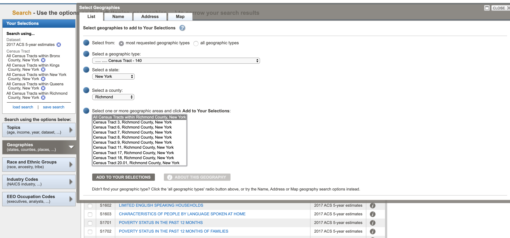

Finally, we need to select the tables that we will be exporting. In this tutorial we will be using the table for 'PLACE OF BIRTH BY NATIVITY AND CITIZENSHIP STATUS (B05002)'. To select this table click on the 'Topics' tab again, and expand 'People' and 'Origins' and click on 'Citizenship'. Once it's been added to your selections you can close that little window. Now you should see a list of all the tables that match your selection criteria. Click on the 'PLACE OF BIRTH BY NATIVITY AND CITIZENSHIP STATUS (B05002)' table. You should now see the selected table with the data for the selected census tracts.

As you can see this table has data on where everyone was born and it comes in the following form:
* Total
  * Native
    * Born in state of residence
    * Born in other state in the United States
      * Northeast
      * Midwest
      * South
      * West
    * Born outside the United States
      * Puerto Rico
      * U.S. Island Areas
      * Born abroad of American parent(s)
  * Foreign born
    * Naturalized U.S. citizen
    * Not a US citizen

On the top, we have every census tract with the corresponding value and a margin of error. It is important to note that these are not exact values, they are estimates based on the statistical methods the census is using. That's why they include the margin of error. These estimates give us a good idea of what is happening on the ground. To learn more about the margin of error in the ACS take a look at [this](http://www.esri.com/~/media/Files/Pdfs/library/whitepapers/pdfs/the-american-community-survey.pdf#page=6) explanation by ESRI.

The last thing we need to do is modify the table so it fits the way data is organized in QGIS. If you remember when we opened attribute tables in QGIS, every row represented a feature and every column represented an attribute. Here, it's the other way around, so we need to 'transpose' the table to make it match QGIS. To do this click on `Modify Table` at the top left and then on `Transpose Rows/Columns`. Now you should see the table with the census tracts on the left-hand column and the fields on the first row.

Finally, click on `Download` and make sure you are selecting 'Use the data' as a comma-delimited (.csv) format with the 'single file' and 'Include descriptive data element names' options selected. Click `OK` and then once your files are ready `Download` again.

### Formatting Census Data
To bring census data into QGIS, we need to re-format the table, so that we can join it to its geographic boundaries. This is a two step process: first, we will format the actual table in Excel, Google Sheets or a simple text editor. Second, we will create a .csvt file, which will tell QGIS the exact format for each of the fields in the table.

As with many things GIS, there are multiple ways of formatting the data. Here, we will give instructions for doing it with either Excel or a text editor (you don't need to do both).

Their are advantages and disadvantages to both methods. The  advantage of using Excel (or Google Sheets) is that if you need to, you can add and _calculate_ new fields; for example, in our case, you can calculate what percentage of the total population was foreign born and add that as a field (you could also do that inside QGIS). However, if you were to do that in a text editor, you would need to manually calculate the value. On the other hand, doing the re-formating through a text editor means that you can control the format of the data much more and that you won't have any problems with Excel auto-converting your data into other types, for example, from text into numbers, etc.

Another great advantage of using Excel is that if you need to delete multiple fields (for example, all the margin of error fields), you can easily do it. Doing it in the text editor would be a nightmare. That being said, there are options, when downloading the data from American FactFinder, to not get the margin of error fields.

#### Re-formatting data in Excel:
  * First, open a new file in Excel.
  * Once you've opened it, click on `File`, `Open...` and navigate to the folder where you saved your downloaded census tables.
  * Make sure you are able to open `All Files` not just `All Readable Files`. In my Mac, that option is called `Enable` and in Windows you should select the option `All Files (*.*)` instead of `All Excel Files (...)`.
  * Once you've done this you will be able to select the file called 'ACS_17_5YR_B05002_with_ann.csv' and open it.
  * Here's a preview of the raw file:

  

  * We need to do two things: One, to rename the field names (header) and get rid of the second row (also a kind of header). And two, delete all the margin of error fields since we are not going to use them.
  * QGIS has certain requirements for field names: maximum 10 characters, no spaces, no punctuation (except - and _ ) and they must start with a letter, not a number.
  * First, delete the margin of error columns. Just right-click / control-click on the column and select `Delete`.
  * Now, rename the header fields in the following way:
    * GeoID
    * GeoID2
    * GeoDisplay
    * TotalPop
    * Native
    * InState
    * OtherSt
    * OtherNE
    * OtherMW
    * OtherS
    * OtherW
    * N_Out
    * PuertoR
    * USIsland
    * AbroadAP
    * Foreign
    * FrgNat
    * FrgNatE
    * FrgNatAs
    * FrgNatAf
    * FrgNatOc
    * FrgNatLA
    * FrgNatNA
    * FrgNonC
    * FrgNonCE
    * FrgNonCAs
    * FrgNonCAf
    * FrgNonCOc
    * FrgNonCLA
    * FrgNonCNA

  * The names don't need to be the same, but this is how I will refer to them. There's no standard way of naming these fields. In general, choose names that you can read and understand, so that you and other people who use these files can easily understand what they mean. The metadata is there to tell you exactly what each of the fields means, but you should be able to figure it out when possible.
  * Once you've renamed your fields, delete the second row. Now you are left with only one header field and the actual data.

  

  * Finally, save your file as a new .csv file. I am saving my file as `B05002.csv`.

#### Re-formatting in a text editor:
  * If you don't have Excel, or you don't want to use it, you can also re-format your file in a simple text editor. Here, I'll use the default Mac TextEdit application. You can also use your Windows Notepad or Sublime Text. As a side note, I highly recommend [Sublime Text](https://www.sublimetext.com/) as a text editor, we will use it later in the semester.
  * First, open the original census table ('ACS_17_5YR_B05002_with_ann.csv') with your text editor.

  

  * Next, before you modify the file, *make a copy, so you don't overwrite the original*. I will save it as B05002_Text_Edit. TextEdit or Notepad will automatically save it as a .txt file, which is fine, though you may change it to .csv.
  * Next, replace the first line (the one that goes from 'GEO.id' to 'HD02_VD27') with the right headers. However, since we are not deleting the columns for the margins of error we need to add those headers. The new first line should be something like this:
    * `GeoID,GeoID2,GeoDisplay,TotalPop,MOTotalPop,Native,MO_Native,InState,MO_InState,OtherSt,MO_OtherSt,OtherNE,MO_OtherNE,OtherMW,MO_OtherMW,OtherS,MO_OtherS,OtherW,MO_OtherW,N_Out,MO_N_Out,PuertoR,MO_PuertoR,USIsland,MO_USIsland,AbroadAP,MO_AbroadAP,Foreign,MO_Foreign,FrgNat,MO_FrgNat,FrgNatE,MO_FrgNatE,FrgNatAs,MO_FrgNatAs,FrgNatAf,MO_FrgNatAf,FrgNatOc,MO_FrgNatOc,FrgNatLA,MO_FrgNatLA,FrgNatNA,MO_FrgNatNA,FrgNonC,MO_FrgNonC,FrgNonCE,MO_FrgNonCE,FrgNonCAs,MO_FrgNonCAs,FrgNonCAf,MO_FrgNonCAf,FrgNonCOc,MO_FrgNonCOc,FrgNonCLA,MO_FrgNonCLA,FrgNonCNA,MO_FrgNonCNA`
    * Notice all the MO (margin of error) and the commas separating all the headers. These are very important.
  * Now delete the second line, the one that goes from 'Id' to 'Not a U.S. citizen'.
  * Your new file should look something like this:

  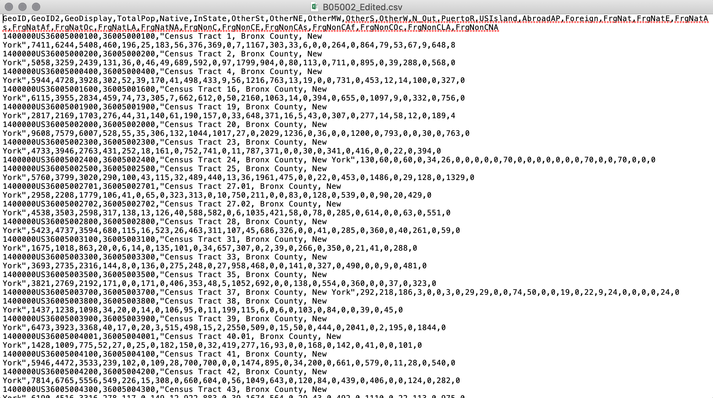

#### Creating the .csvt file:
  * In both cases you need to create also a .csvt file. This file will tell QGIS exactly what type of data each of the fields is in. The different types of data your fields can take are:
    * String - Represents text
    * Integer - Represents whole numbers
    * Real - Represents both negative and positive numbers, with decimal points
    * Date - Date in the format YYYY-MM-DD
    * Time - Time in the format HH:MM:SS+nn
    * DateTime - Date and time in the format YYYY-MM-DD HH:MM:SS+nn
  * So, for every column we need to specify what type the data is in.
  * For this step you will need to use a text editor. In your text editor, open a new file.
  * Now, for every field, write the type of data it takes in quotation marks. So, for the Excel file, where we don't have the margin of error fields you would write: `"String","String","String","Integer","Integer","Integer","Integer","Integer","Integer","Integer","Integer","Integer","Integer","Integer","Integer","Integer","Integer","Integer","Integer","Integer","Integer","Integer","Integer","Integer","Integer","Integer","Integer","Integer","Integer"` Note that every item is separated by a comma and that the first three fields, even though they seem like they are numbers, are actually text fields. This is very important, since we are going to use those fields to join our census table to the census boundaries, which also contain those fields as text. If we have one file with text and another with integers or real numbers, the program won't be able to match it.
  * If you are working on Mac's TextEdit you need to format your file as 'Plain Text'. To do this click on `Format` and then `Make Plain Text`. This will change your file from an .rtf to a simple .txt.
  * Save your file with the same name as the table but with a different extension. It is important to do this so that QGIS understands that this .csvt file corresponds to the other .csv or .txt file. In both Windows Notepad and in Mac TextEdit you need to manually type the extension (.csvt) and in TextEdit you need to un-check the option that says 'If no extension is provided, use .txt'.
  * If you are using the table we modified with Excel your .csvt file would be named `B05002.csvt`
  * If you were using the table we modified with TextEdit or Notepad you would name your file `B05002_Text_Edit.csvt`

  * Your final file should look something like this:

  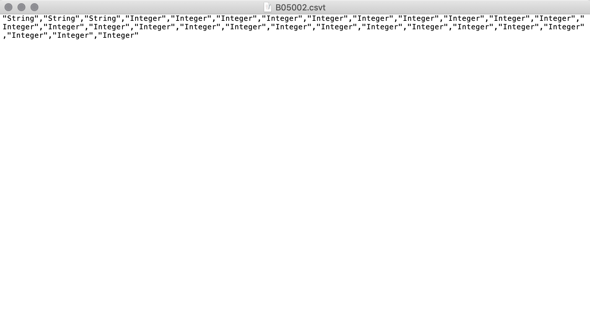

* Now that the files are ready we can move into QGIS and bring everything together.

#### Importing tables into QGIS
* First open QGIS and add the boroughs (nybb) file we've been working with in past tutorials. The reason this is the first file we add is so that the map takes on that file's projection. This is important because the census boundaries come in a different projection so if we add those first our final map will have a projection that's not the normal New York City one.
* Now add the census boundaries that we downloaded at the beginning of the tutorial.
* Once you've loaded the census boundaries, open it's attribute table. You will notice that the fourth column is called 'GEOID'. That's the one we will use to join our census table to. Close the attribute table.
* Now, to add the census table click on the 'Add a delimited text layer' button:

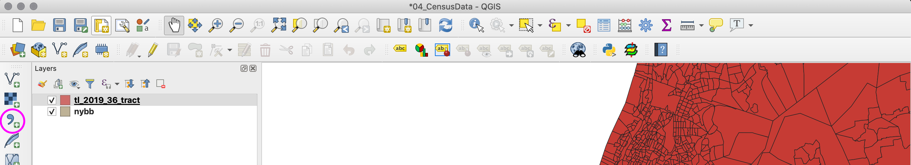

* Select the .csv or .txt file with our data.
* If you added the .csv file the `CSV (Comma Separated Values)` option should be checked.
* If you added the .txt file the `Custom delimiters` option should be checked, as well as the `Comma` option, so that the program know we are delimiting our data using commas.
* In both cases the option `First record has field names` should be checked so that the program recognizes our headers and in the 'Geometry definition' the option `No geometry (attribute only table)` should be selected too (our files don't contain coordinates or geometrical attributes).
* Your import options should look something like this (for the .csv file):

* The ones for the .txt file should look like this:

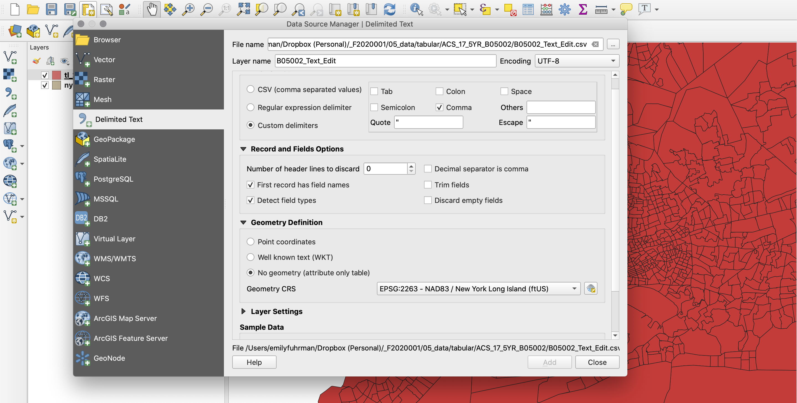

* Click `OK` to import the table, and once you do it you should have it listed on your 'Layers Panel'. If you right-click / control-click on the table and open the attribute table. You should see all your values there.

#### Joining tables to shapefiles
* To join the census table to the shapefile with the geographic boundaries, double click on the census boundaries layer and go to the properties panel. There, choose the `Joins` tab.
* In the `Joins` tab, click on the button with the plus sign to create a new join with the following settings:
  * Join layer: B05002 (the census table)
  * Join field: GeoID2 (the field that contains the unique identifier for each census tract)
  * Target field: GEOID (the field in the census boundaries that contains the unique identifier)
  * Custom field name prefix: checked and delete what is in there. This is useful when you want to add a prefix for the fields that are joined, for example, when you are joining multiple tables and you want to differentiate them. In our case, since we are only joining one table we don't need this prefix.
  * The menu should look something like this:

  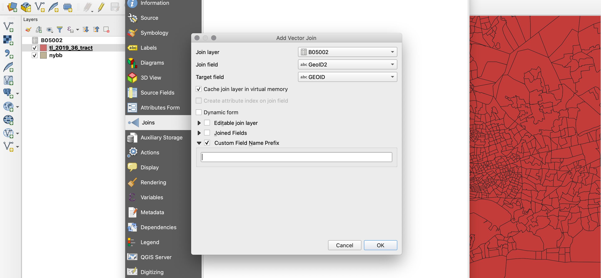

  * Click `OK` and then `OK` again.

* Now, if you open the attribute table of the census boundaries you will notice that a lot of the census tracts have the information from the table that we added. The ones that have `NULL` values are the ones outside New York City. Remember that we downloaded census tract boundaries not just for New York City but for New York State, so now we need to filter those census tracts out.
* An easy way to do this is to select all the census tracts that are not `NULL` for one of our main field, for example the GeoDisplay field.
* To do this, go to the attribute table and create a selection expression that says `"GeoDisplay" IS NOT NULL` and click `Select`. You should have now 2,167 features selected and if you click `Close` and close the attribute table too, these selected features should correspond to New York City.

* Now export these selected features as a new shapefile and make sure it takes the right projection for New York City. Make sure also that when you are exporting you check the option that says `Save only selected features`, otherwise you will export all features, including the ones that don't have any census data.
* Now you have a shapefile only with New York City census tracts with all the data that we downloaded.

#### Symbolizing the data
The last part in our process is to finally symbolize the data and see what comes out of it. For this tutorial we will symbolize the number of people who are foreign born in each census tract. However, it is very important to _normalize_ the data. Since not all census tracts have the same number of people living in them, showing just total count of foreign born people would not be useful; the census tracts with more inhabitants would probably have more foreigners too. That's why we should normalize by the total number of people living in each census tract.

In general, you should always try to normalize your data and this is usually going to be either by population or by area. Some examples are, cars per inhabitant, murders per 1,000 people, cell phones per person, built square footage per acre of land, income per capita. Always ask yourself if it wouldn't make more sense to view the data normalized by something else instead of just raw numbers.

First, just so you can see the difference between the different classification methods, let's classify the census data. We will do it with the raw numbers, knowing that for our final map we will normalize the data based on the total population in each census tract:
* Equal Interval classification:
  * Go to the properties of your census data shapefile and then to the style tab.
  * Change the classification from `Single Symbol` to `Graduated`.
  * In the column field, choose 'Foreign' and click on the `Classify` button. The panel in the middle should populate with 5 different ranges of values.
  * The default mode of classification is `Equal Interval`.
  * You will notice that the breaks start from 0 and advance in increments of 1581.8. The `Equal Interval` takes the full range of the *values* and divides it into the number of classes (in our case, 5).
  * If you click on the `Histogram` option and then on the `Load values` button you will see how the program divides the data.
  * Click `OK` and take a look at the map:

  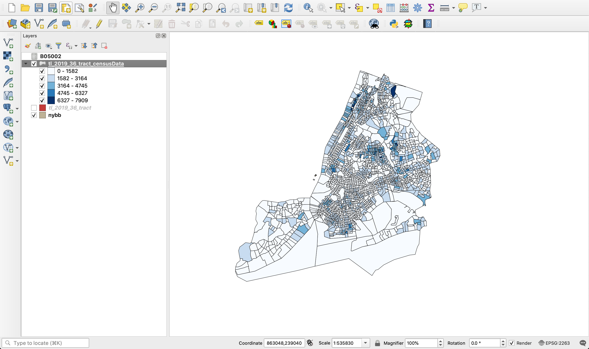

  * You will notice that most census tracts fall within the first or second class and that there are only a handful of them in the third, fourth or fifth.
  * With this classification method we see the effect an extreme value can have on the graphic representation of data: the census tract in the Bronx that represents Co-Op City is skewing the data towards the top so that there are too few census tracts in the intermediate classes.

* Quantile (Equal Count)
  * Now return to the classification option in the style properties of the dataset.
  * Choose `Quantile (Equal Count)` as the classification mode.
  * This classification method gets the total number of features and divides it by the number of classes, so that each class has an equal number of features. The problem with this method is that features that might be very far apart in terms of their values might end up in the same class.
  * Go to the `Histogram` tab and click on `Load values` to see how this classification method splits the data.
  * Click `OK` and take a look at the map:

  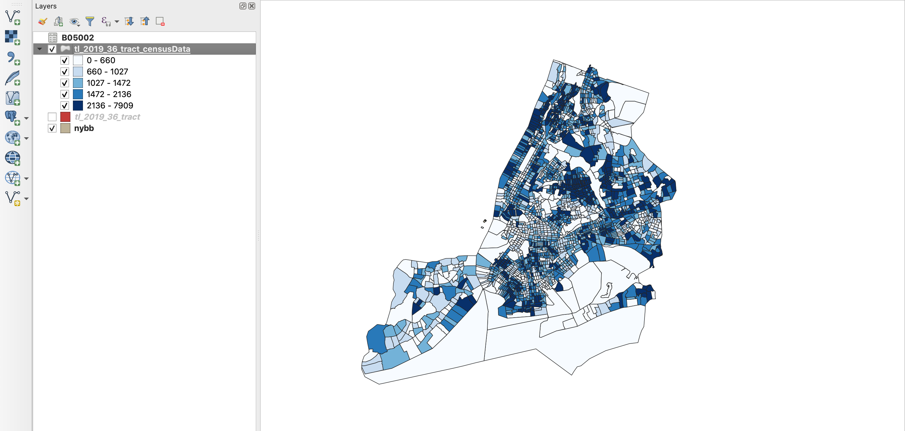

  * Here you see how every class has an equal number of features, but for example the census tract for Co-Op City, which we know has one of the highest counts of foreigners in the city, gets lumped up with many other census tracts, some of which might not have that many foreigners.

* Natural Breaks (Jenks)
  * Now change the classification method to `Natural Breaks (Jenks)`.
  * This classification method looks at the data and tries to maximize the difference between classes while minimizing the difference inside each class.
  * Take a look at the `Histogram` to see how this classification method treats the data.
  * You see how the divisions in the data follow the general pattern of the histogram.
  * Click `OK` and take a look at the map:

  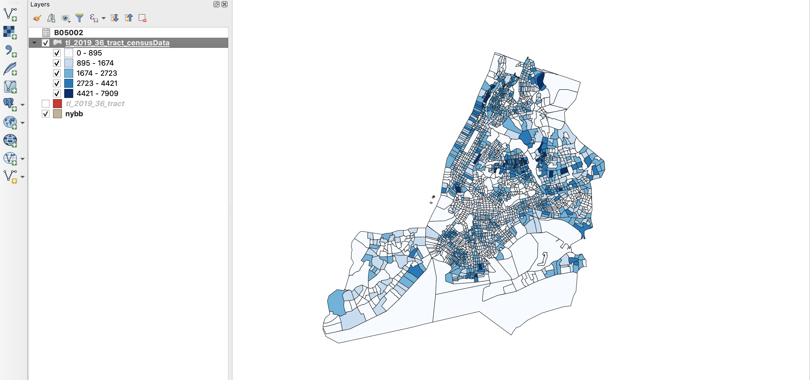

  * This map is probably the most balanced one, clearly underlining the census tracts that have high values but still showing the variation in the rest of the census tracts.

* Standard Deviation
  * Finally, change the classification method to `Standard Deviation`.
  * With this classification method it's always good to also change the color scale to a 'diverging' color scheme, something that starts with one color, goes through a neutral (or white) color and ends up in another color. This type of color scale makes it clear that there are some 'neutral' values and that there are some other values that are higher or lower than those.
  * However, there's a problem with how QGIS classifies values here. The problem that QGIS has here is that it doesn't make the 'neutral' color correspond to the values around the mean or within 1 standard deviation of the mean. In this case, if you click `OK` you will see that the 'neutral' color actually corresponds to the values between 2 and 4 standard deviations away from the mean, which is pretty misleading; with our current dataset, you may not even see more than one class defined. This classification method would only actually work well with a normally distributed dataset, which doesn't always happen. 
  * Take a look at these two maps: they are based on the same dataset. The only difference is that the left one was made with QGIS and the other one with ArcMap. The ArcMap one correctly makes the 'neutral' color correspond to the values that are between -0.5 and +0.5 standard deviations away from the mean, so the most 'normal' values.

  

* In any case, this little exercise shows you the importance of choosing the right classification method for your data.

Finally, to create the last version of our map we need to normalize our data by the total population in the census tract. So the actual data that we will use is going to be: 'Foreign Population' / 'Total Population'. In other words, we will show percentage of foreign born population per census tract.
* To do this first go to the classification option for the census dataset.
* In the `Column` option, click on the `ε` option. Here we will write a little expression to normalize our data.

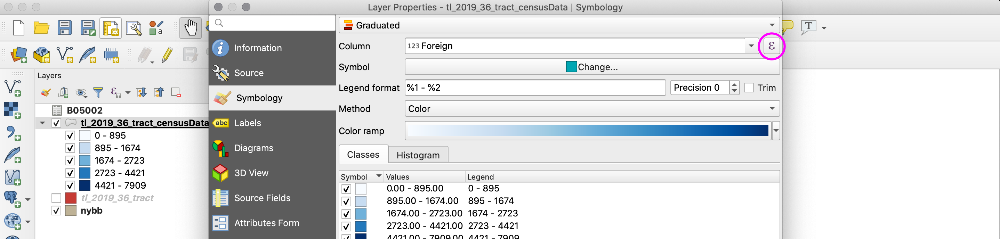

* In this panel, choose the 'Foreign' field and divide it by the 'TotalPop' field. Your expression should read: ` "Foreign" / "TotalPop"`.

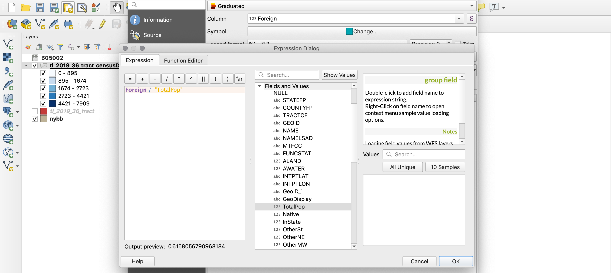

* Once you've done this, choose the right classification method (in our case that's probably going to be 'Natural Breaks' or 'Equal Intervals') and the right color scheme.
* You can always modify slightly the values for the classes to round off the numbers and make the value ranges be more understandable. You do this by double-clicking on the specific value under `Values`.
* In my case, my value ranges are:
  * 0 - 0.20
  * 0.20 - 0.35
  * 0.34 - 0.45
  * 0.45 - 0.60
  * 0.60 - 0.85
* Once you've classified correctly your data, click `OK` and make sure your map makes sense.

**_BONUS:_** Some of the tracts seem to disappear after running this calculation. Can you figure out why? How might you fix this?

Lastly, we need to hide the census block groups that fall outside of the New York City borough boundaries. If you look closely at the census block group layer, you will see that there are some block groups that fall inside the Hudson River and that shouldn't be included in our map.

There are a couple of ways of doing this: one option would be to clip the block group layer using the borough layer, in order to get rid of the census block groups that fall outside the boroughs. However, this option would permanently modify the block group layer and, if at any point the borough boundaries don't align perfectly with the block groups (which is entirely possible), the geometry of those block groups would be changed too. The best option then is to hide the block groups that fall inside the water and conveniently enough there is a field in the block group attribute table that has a specific value for these features.
* First, open the attribute table of the CensusData layer. You will notice that there is a field called 'ALAND' and another called 'AWATER'. 'ALAND' has a unique identifier for each of the block groups that has some land area; 'AWATER' has an identifier for those block groups that have some water. The problem is that some block groups have both water and land. So we will only show those block groups where the 'ALAND' field does not equal 0, meaning that they have some land.
* To do this we will create a 'Feature subset'. Open the layer properties and go to the `Source` tab. At the bottom of this tab you will see the 'Provider Feature Filter' panel. Go to the bottom of this panel and click on the `Query Builder` button. This query builder will work in a similar way as the 'Selection by attributes' query builder.

* In the 'Fields' panel you will see the 'ALAND' field. Double-click on this to make it appear in the bottom panel ('Provider specific filter expression').
* Now add '!= 0' to the expression. ('!=' means 'does not equal').
* Your expression should look something like this:

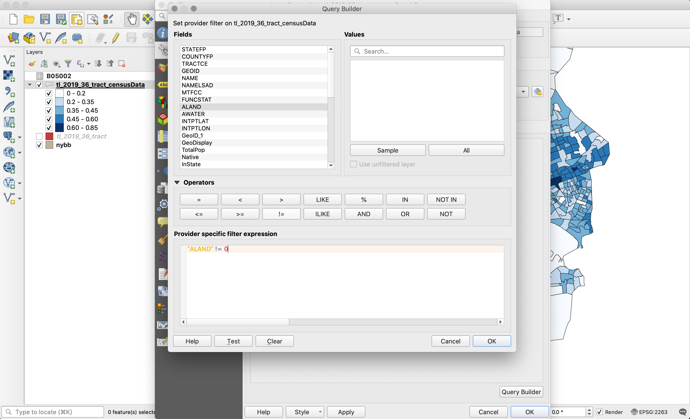

* Click `OK` in the 'Query Builder' and then `OK` again in the 'Properties' panel. Your map should now only show the census block groups that have land.

You may wish to change the projection of the whole project at this point. It should be in NAD83/New York Long Island EPSG 2263. Click on the project projection in the bottom right hand corner to open the project projection options.

Once you are finished with this go ahead and adjust colors, strokes and layer order. And finally, create a print composer, add a legend, title, explanation, source and a scale bar, and export your map as a PDF file. Your final map should look something like this:

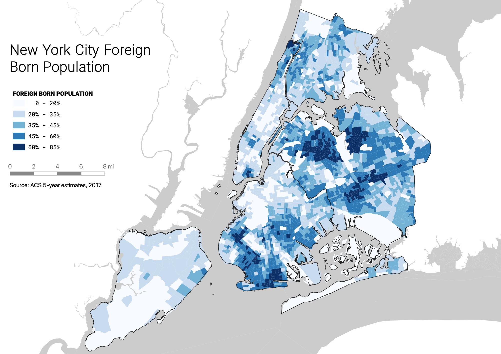

#### Deliverables
Upload your (PDF) map to Canvas. Your map should include a legend, scale bar, title, explanation and source.

______________________________________________________________________________________________________________

Tutorial created by Juan Francisco Saldarriaga (jfs2118@columbia.edu) for the Mapping for Architecture, Urbanism and the Humanities class at Columbia University. Edited by Michelle McSweeney for Fall 2017, Brian House for Fall 2018, and Emily Fuhrman for Spring 2020.
