## Tutorial 5: Analyzing Data

Through this exercise you will learn key tools of analysis using QGIS. After completing these exercises you should be able to…

* Use proximity based measures
* Understand the principles and applications of boolean operations
* Conduct spatial joins
* Explain and perform proportional split population estimates
* Create a basic density map (and understand the potential pitfalls of this type of visualization)
* Perform basic raster math operations
* Develop a raster based decision mapping methodology to answer a specific question
* Adapt a raster dataset to your own research needs through raster re-classification

#### Premise
We are interested in looking at libraries in the Bronx as a public resource. We will use proximity based measures to the zones of impact (and potential impact) of libraries on Bronx residents from a number of different perspectives. First we want to evaluate which library branches are located within areas that have a high number of Spanish speaking residents. Then we will evaluate which libraries serve the greatest number of school children.

#### Research questions
* Where are Bronx Library branches?
* Which Library branch locations are within areas with a high number of Spanish speaking residents?
* How many public schools are located within ¼ mile of a library?
* Which five libraries serve the most students?
* What is the nearest library to each school?
* How many people do these libraries serve?

#### The Strategy
To evaluate the confluence of Spanish speakers and branch libraries we will first select using an expression and then select by area to identify which libraries fall in census tracts with a high percentage of Spanish speakers.

Then to evaluate which libraries serve the greatest number of school children we will first create a buffer around each library location of ½ mile (which we will be able to export as its own layer to display on our map). We will then use a spatial join in order to count the number of schools within ½ mile of a library and to determine the number of students enrolled in those schools.

#### Before you begin
If you haven't already, download the GitHub repository for this course. Using the green button [here](https://github.com/CenterForSpatialResearch/mapping-architecture-urbanism-humanities), select `Download ZIP`. The Data folder will then have all of the datasets needed for tutorials.

#### Let’s Begin

**Launch** QGIS.

Select the `add vector data` button and navigate to the `5_AnalyzingData/Shape` folder and add the following three Layers:
* Bronx_Tracts_2014.shp
* Bronx_Schools.shp
* Bronx_Libraries.shp

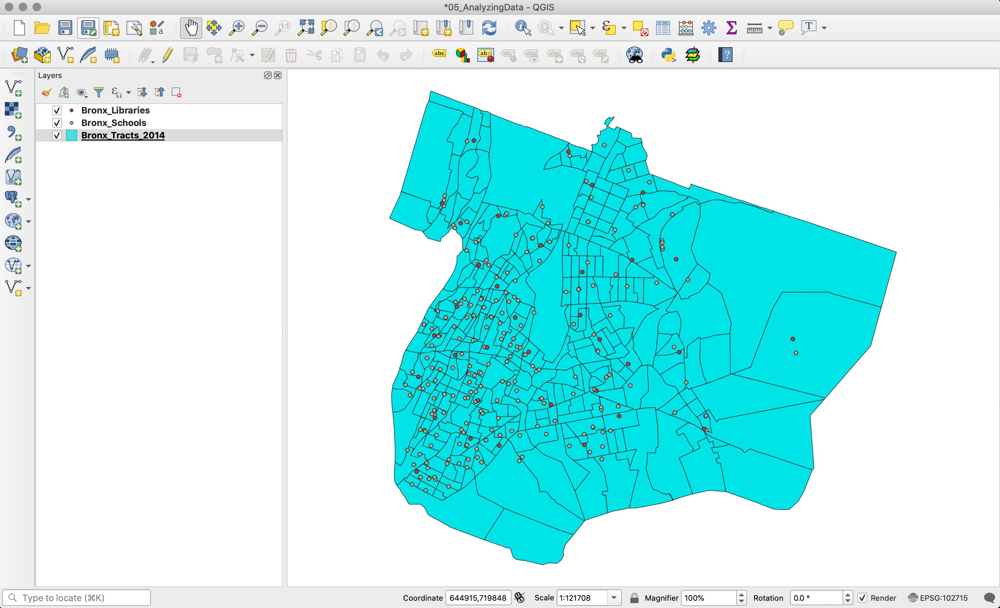

First **open** the attribute table of each data layer and inspect its contents.

The field names for `Bronx_Tracts_2014` are:

* `STATEFP`: the State FIPS code
* `COUNTYFP`: the county FIPS code
* `TRACTCE`: the FIPS code for the census tract
* `GEOID`: the unique FIPS code that combines the state, county, and tract code for each tract.
* `NAMESLAD`: the name of the census tract
* `ALAND`: the area of the census tract that is land
* `AWATER`: the area of the census tract that is water
* `INTPTLAT`: the latitude coordinate of the locator of the census tract
* `INTPTLON`: the longitude coordinate of the locators of the census tract
* `Pop2014`: the population of the census tract in 2014 according to the [American Community Survey 2014 5 Year Estimates]( http://factfinder.census.gov/faces/tableservices/jsf/pages/productview.xhtml?pid=ACS_14_5YR_B01003&prodType=table)
* `PopOver5`: Population over 5 Years old
* `Pct_OnlyEn`: the percent of the population over 5 years old within the census tract that speaks only English
* `Pct_Other`: the percent of the population over 5 years old within the census tract that speaks another language in addition to (or instead of) English
* `Pct_Spanis=h`: the percent of the percent of the population over 5 years old within the census tract that speaks Spanish

The field names for `Bronx_Libraries` are:

* `facname`: the name of the facility
* `borough`: the borough of the library – in this case they are all in the Bronx
* `ft_decode`: the type of library it is, Branch or Central
* `facaddress`: the address of the library
* `zipcode`: the zipcode of the library
* `ForRaster`: ignore this for now – it was created for an operation we will perform on the dataset in a later exercise.

The field names for `Bronx_Schools` are:

* `BORO`: a code for the name of the borough the school is within
* `BORONUM`: a numeric code for the borough the school is within
* `SCHOOLNAME`: the name of the school
* `SCH_TYPE`: the type of school, Elementary, K-8 etc
* `ADDRESS`: the school’s address
* `ZIP`: the school’s zipcode
* `GRADES`: the grades within the school
* `Enrollment`: the number of students enrolled in the school
* `Raster`: again ignore this field for now

#### Finding libraries near concentrations of Spanish speakers

We want to determine which libraries are located within census tracts where more than 65% of the population speaks Spanish. We are interested in determining which libraries might be well suited to receive additional resources to go towards multilingual programs.

* **Open** the attribute table of the Bronx_Tracts layer and choose the `select using an expression` tool. Select census tracts where more than 65 percent of the population over 5 years old speaks Spanish. Your expression should look like this. Click `Select`. You should see that 56 features were selected. Close the attribute table.

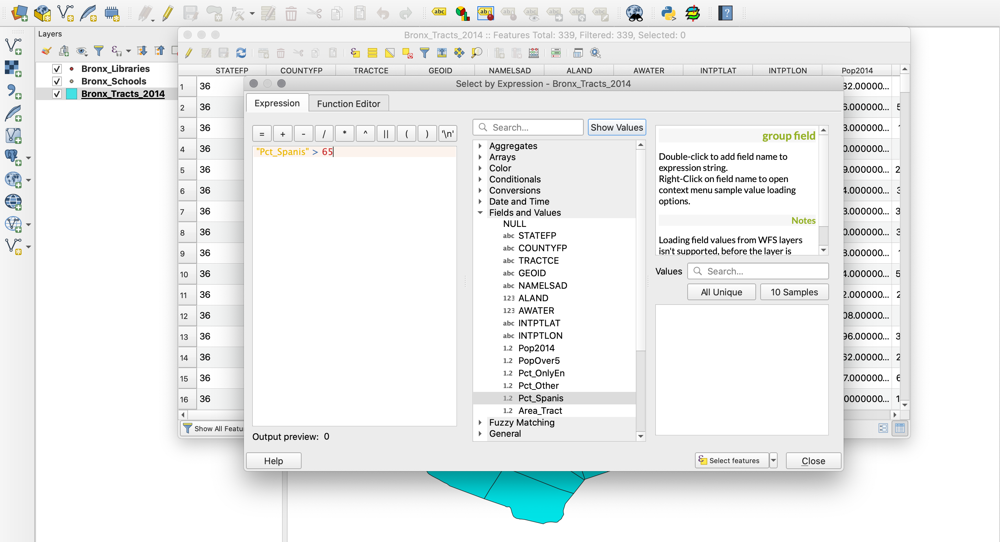

* Now we will determine which libraries lie within these census tracts by using the select by location tool. **Navigate** to the `Vector` > `Research Tools` > `Select by Location` in the menu bar. Then make the following selections:

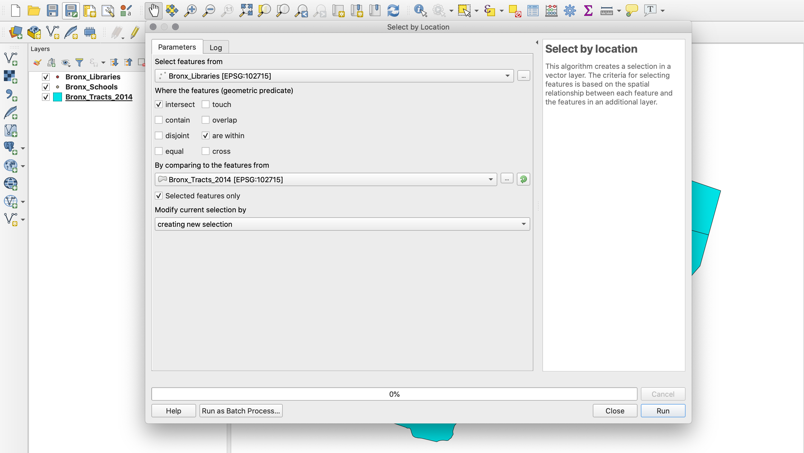

* Open the attribute table of the `Bronx_Libraries` layer in order to note which libraries were selected. Four libraries were selected, what are their names?

This analysis give us a very rough sense of which libraries might already serve a large number of Spanish speakers however we have only selected libraries which are located exactly within census tracts with a large proportion of Spanish speakers. What if there is a library in an adjacent census tract? Our analysis will not have picked up on this.

Now, before moving on, deselect all features from all layers.

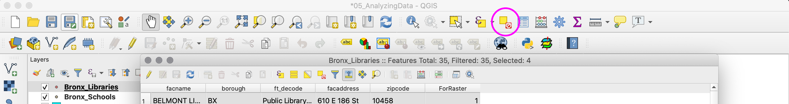

#### Schools and Libraries
Now we will depart from questions about language and instead ask a series of questions about the relationship between schools and libraries in the Bronx. Specifically we will ask:
* How many schools are within ¼ mile of Bronx libraries?
* How many students are enrolled in schools that are within ¼ mile of a Bronx library?
* What is the nearest library to each school?

To answer the first question, we will create a ¼ mile buffer around the libraries.

##### Creating Buffers
* On your menu bar navigate to `Vector`>`Geoprocessing Tools` > `Buffer`.

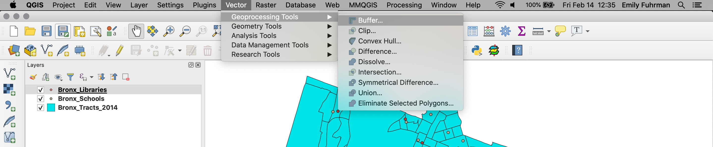

* Your menu may read `Vector > Geoprocessing Tools > Fixed distance buffer`. `Variable Distance Buffer` is another possible tool, but for now we will use Fixed Distance.

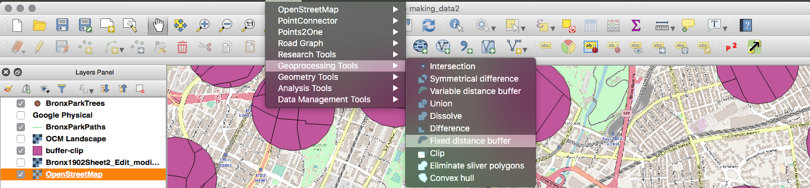

  * Choose Bronx_Libraries as your input vector layer – this sets which layer the buffers are drawn around.

  * Set the buffer distance to 1320. The values in this field have the same units as the projection of your input datalayer and map project. Our map is projected in the NAD83 New York State Plane (Long Island) projection system whose units are in feet. To confirm this you can open the layer properties and inspect the coordinate reference system for the layer. Thus we choose 1320 feet because this is equivalent to ¼ mile.

  * Save the output layer as `BX_Library_QuarterMiBuffer`.

  * Your map should look something like the following:

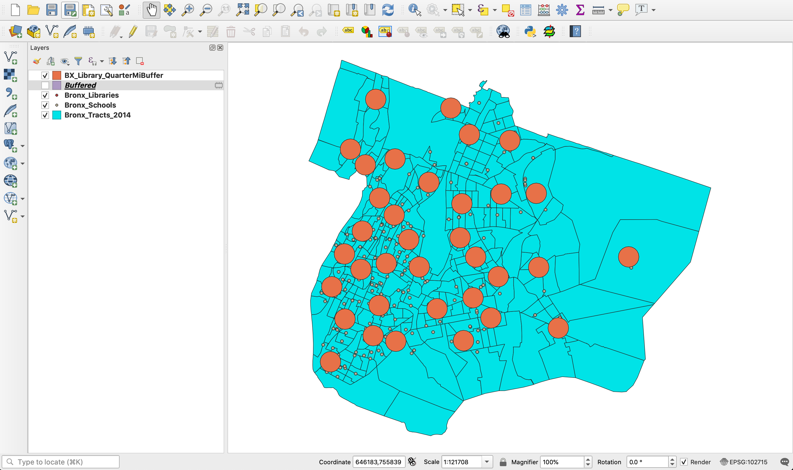

* Next we will use the select by location tool to determine which schools fall within ¼ mile of a library. Navigate to `Vector`>`Research Tools`>`Select By Location`
  * Select features in  `Bronx_Schools` that intersect or are within features in `BX_Library_QuarterMiBuffer`
      - This menu can look different in various installations of QGIS. If your menu looks like the following, use the following selections:

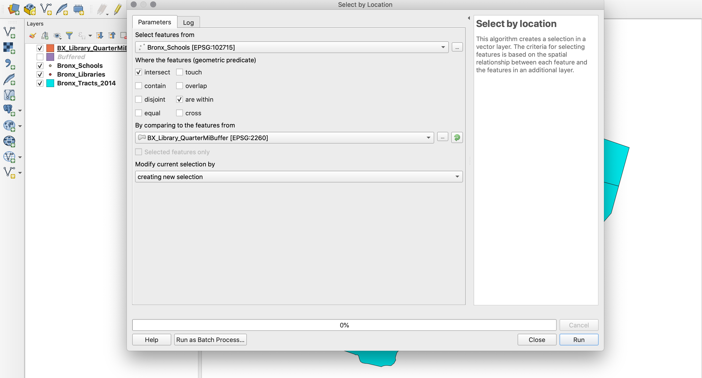

  * Select Run, and then close.

  * Open the attribute table of `Bronx_Schools` and notice that 90 schools were selected. Thus there are 90 schools in the Bronx that are within ¼ mile of a library.

*  Now we want to answer our second question:  Which five libraries serve the greatest number of school children? To answer this, we will perform a *spatial join*.

  * A spatial join is a new tool for us which allows us to summarize the attributes from one layer within the attribute table of another based on the spatial relationship between them.

  * Navigate to `Vector`>`Data Management Tools`>`Join attributes by location`.

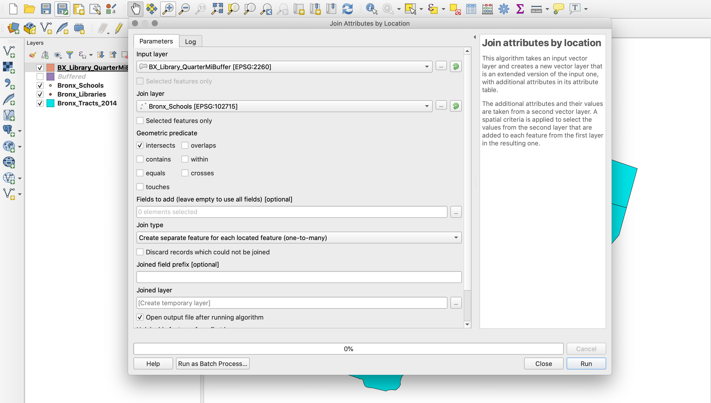

  * Just like with a table join the `Input layer` is the layer to which we would like to join new information to and the `Join layer` is the layer which we are joining to the input layer. In our case BX_Library_QuarteMiBuffer is the `Input layer` and Bronx_Schools is the `Join layer`. _(Note: Given there might be multiple features in the join layer within a single feature of the target layer, QGIS will automatically sum the values of all dimensions within the join layer when performing this join.)_

  * Select `OK`.

  * A box will appear letting you know that a new layer has been created as a result of this spatial join. Click `OK`. Then close the `Join attributes by location` dialogue box.

  * Save the output layer as `BX_Library_QuartMiBuffer_SchoolsJoin`.

  * **Open** the attribute table for this layer. Notice the new field `Enrollment` that has been added on. This field contains the sum of the enrollments for all of the schools within the buffer.

  * Which five libraries serve the greatest number of enrolled school children? Sort the attribute table by `Enrollment` and identify the top five libraries.

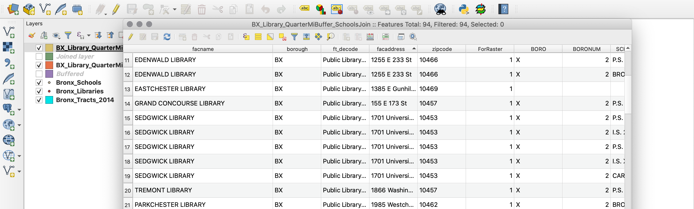

##### Using a Distance Matrix

*  Now we will move on to answer our third question: which is the nearest library to each public school?
  * To answer this question we will again introduce a new tool of analysis, `DistanceMatrix` tool. This tool takes two point layers and computes the linear distance between each feature in both layers.
  * Make sure you do not have any features still selected
  * Navigate on your menu bar to `Vector`>`Analysis Tools`>`DistanceMatrix`
  * Select `Bronx_Schools` as the `Input point layer`. Set `SCHOOLNAME` as the `Input unique ID field`. The input point layer is the layer that the distance of the target point layer will be measured in relation to.
  * Select `Bronx_Libraries` as the `Target point layer` and `facname` as the `Target unique ID field`.
  * For the output matrix type select `Linear (N*k x 3) distance matrix`, and select `Use only the nearest (k) target points` and set this to 1.
  
 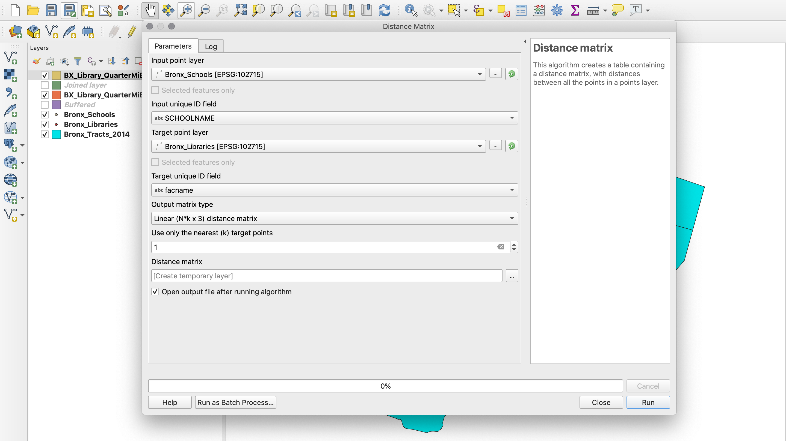
  
  * Run the process, and then open the Attribute Table of the resulting layer

  * You will see that we have generated a table where each school is matched with its nearest library and QGIS has computed the distance between them in feet.

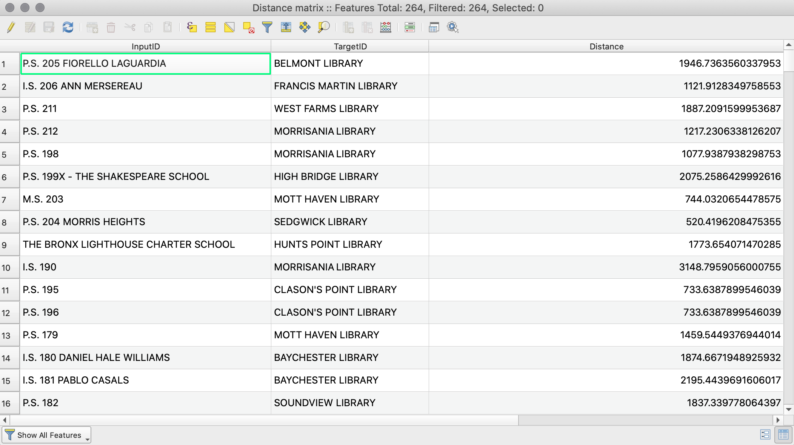

##### Making Estimates
We now have gathered information about how many schools are within ¼ mile of each library, as well as the total number of children enrolled in those schools and we have also computed the nearest library to each school. Now we would like to determine more generally how many people live near libraries in the Bronx – i.e. how many people do Bronx libraries serve?

In order to answer this question we will need to estimate the total population near libraries in the Bronx. We will first use a coarse method of estimation and then we will refine our estimate using a more advanced technique.

For our first approximation we will ask: how many people live in the census tracts that intersect a ¼ mile buffer around our libraries?

* We will use the select by location tool to select all of the census tracts that intersect one of our ¼ mile buffers around the libraries.

* Navigate to `Vector`>`Research Tools`>`Select by location`. And make the following selections:

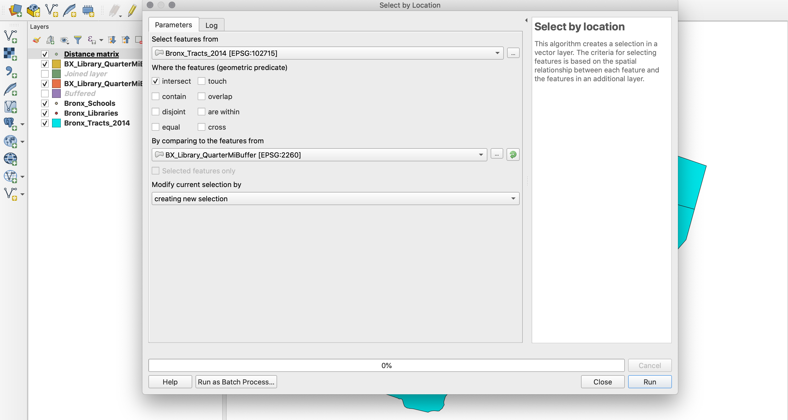

* Select ‘OK’ and then `Close`.
* Your selections should look something like this:

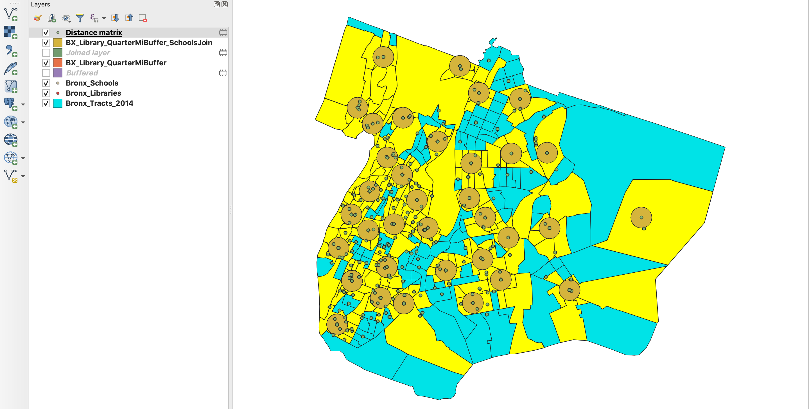

* We can already tell that this will be a very coarse way to estimate the population served by each of the Bronx libraries because some census tracts which intersect our buffers are very large and portions of the tract are very far away from any library.

* Despite this we now want to add up the total population within these selected census tracts.  To determine the total population of all of the census tracts that intersect a ¼ mile buffer of a Bronx library. To do this we will use the `Basic statistics` tool. Navigate to  `Vector`>`Analysis Tools`>`Basic Statistics for Fields`. Make the following selections and click `OK`.

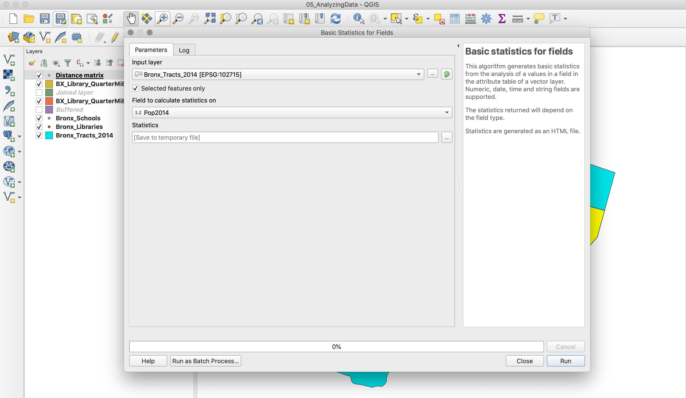

* Look at the log readout in the "Log" tab, or click to open the Results Viewer HTML link that appears in the panel to the right.
* We see from the `Sum:` field that the total population of all of the census tracts that intersect a ¼ mile buffer around a Bronx library is 983,821. Make a note of this total we will compare it to the result we get in the next portion of the exercise.

Now we will refine our estimate of the population near libraries. We will estimate the population that lives precisely within our ¼ mile buffers using using a method called *proportional split estimation*. A proportional split is a way to estimate the proportion of a quantitative attribute that falls within a portion of a polygon’s area. A proportional split is calculated in a few fairly simple steps.

1. We calculate the area of each polygon unit
2. Clip the polygons to the boundary of the study area (in our case the ¼ mile buffers)
3. Calculate the area of the polygons after clipping them to the study area
4. Divide the area of the polygons within the study area by their original area to determine the proportion of the original area that falls within the study area
5. Multiply the attributes (for us, population in 2014) we wish to estimate by the proportion in order to estimate the proportion of the attribute that falls within the study area.
Note: that proportional split estimation assumes that the attribute you are estimating is evenly distributed through out the polygon. In reality, the population within each census tract is not evenly distributed nevertheless thus this is an estimate.

**Calculating the area of the census tracts**
* Open the attribute table for the Bronx census tracts layer and select the field calculator – computing this will automatically turn on editing mode, so treat this as though you are now altering the `Bronx_tracts_2014` shapefile.

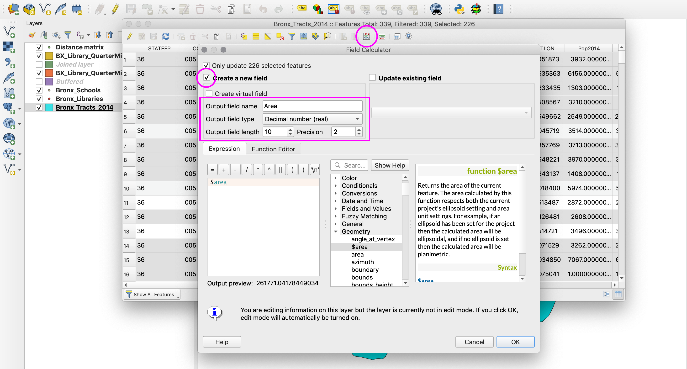

* Create a new field, assign the Output field name as `Area`, the Output field type as `Decimal number (real)`, the Output field width as `10` and the Precision `2`. Open the Geometry menu and double click on `$area`
* Click `OK`
* Scroll to the right in the attribute table for the Bronx census tracts and see the new field that you have added. Now select the `Toggle editing mode` (pencil icon) button to exit the editing mode. You will be asked if you want to save your changes, say `Save`.
* Note: Census tracts extend into the water so the area we are calculating here includes both land area and area of the tract that might be in the water. This introduces some error into our proportional split estimation. One way to be even more precise in our estimate is to clip the census tract polygons by the shoreline prior to embarking on this analysis.

**Clipping the census tracts to the ¼ mile buffers**  

* Next we will use the `clip` tool to clip the Bronx census tracts with the ¼ mile buffers around the Bronx libraries.
* Navigate to `Vector`>`Geoprocessing Tools`>`Clip`

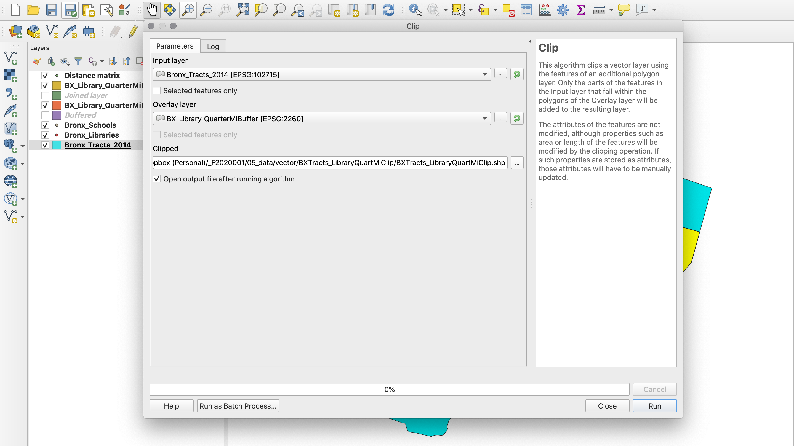

* The input vector layer is the layer you will clip (in our case the Bronx census tracts)
* The Clip layer is the layer you will use to clip the input layer (in our case the ¼ mile buffers around the libraries).
* Save the Output shapefile as `BXTracts_LibraryQuartMiClip`.
* Click `OK` and then `Close`
* A new layer containing the census tracts clipped to the ¼ mile buffers around the libraries was added to your map.
* Toggle the visibility of all of of the layers on your map off except for `BXTracts_LibraryQuartMiClip`.
* Use the select tool to click on some of the individual clipped census tract polygons to familiarize yourself with this new layer.

 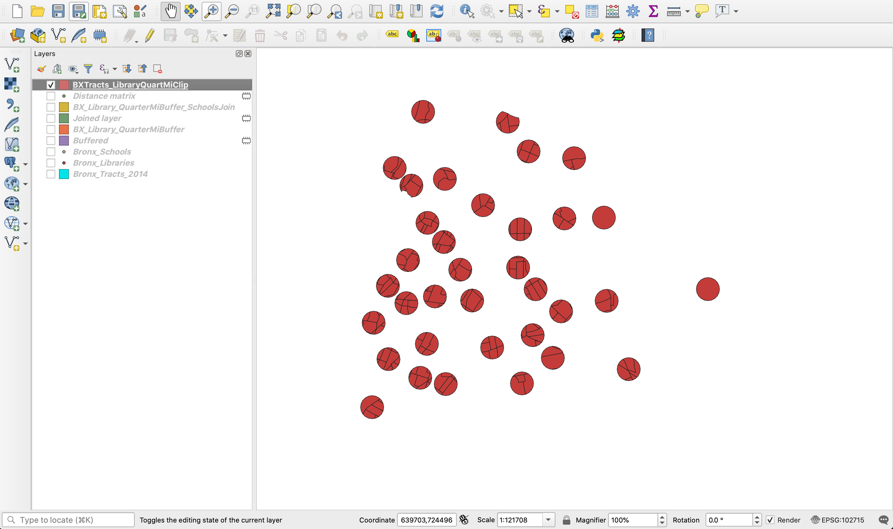

**Calculating the area of the clipped census tracts** 

* Now we will calculate the area of these new polygons.
* Open the attribute table for the clipped Bronx census tracts layer: `BXTracts_LibraryQuartMiClip`.
* Open the field calculator and again create a new field to calculate the new area of each polygon.
* Set the Output field name as `AreaClip`,
* Select `Decimal number (real)` as the output field type, Set the output field width as 10 and the precision as 2. Under the geometry menu select `$area`. Click `OK`.
* Notice the new field that has been added to the far right of the attribute table called `AreaClip`

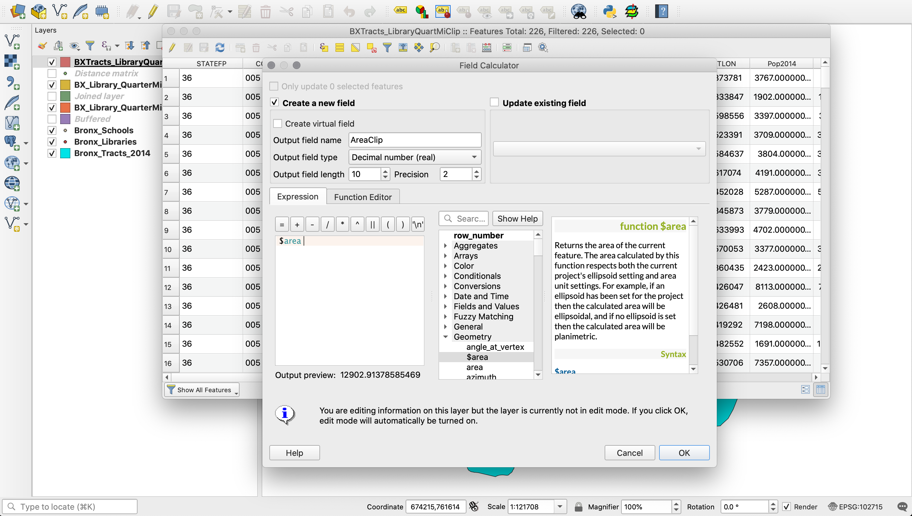  

**Dividing the the area of the clipped census tracts by their original area**
* Again open the field calculator and calculate a new field.
* Set the Output field name as `Proportion`,
* Select `Decimal number (real)` as the output field type, Set the output field width as 10 and the precision as 2.
* Calculate `"AreaClip" / "Area"` -- i.e. the proportion of the original area that remained after the clip
* Click `OK`

**Multiplying the population by the proportion**

* Now we will calculate one final field where we’ll multiply the attributes (for us, population in 2014) we wish to estimate by the proportion in order to estimate the proportion of the attribute that falls within the study area.
* Again open the field calculator and calculate a new field.
* Set the Output field name as `Pop2014est`
* Select `Decimal number (real)` as the output field type, Set the output field width as 10 and the precision as 2.
* Calculate `"Proportion" * "Pop2014"`
* Click `OK`
* End the edit session and say yes to saving the changes.

Now we will compare the total estimated population within the buffers to the original rough population estimate we made at the beginning of this exercise using the select by location tool.

* Navigate to `Vector` > `Analysis Tools` > `Basic Statistics for Fields`.
* Select Pop2014est as the Target field and note the Sum
* Repeat for the population field for the entire census tract Pop2014 and note the difference

#### What to Submit
Please send an image (can be a simple screenshot) of the clipped buffers (the stage where it is just circles), and what number you got for the proportional split population estimate.

______________________________________________________________________________________________________________

Tutorial written by Dare Brawley, for *Mapping for the Urban Humanities*, a intensive workshop for Columbia University faculty taught in Summer 2016 by the [Center for Spatial Research](http://c4sr.columbia.edu). Edited by Brian House for Fall 2018 and Emily Fuhrman for Spring 2020.
