## Tutorial 6: Working with Projections

Projections enable us to represent the earth on a flat surface. The WGS84 Geographic Coordinate System is the default projection in QGIS. This tutorial will walk through the process of creating a U.S. population density map in the Albers equal-area conic projection, a standard way of representing the United States with minimal distortion.

### Datasets
This tutorial will incorporate three datasets: one provided by Natural Earth, and two provided by the U.S. Census. First, download the current state administrative boundaries from Natural Earth, as well as 2017 state territories (both land and water) from the U.S. Census, listed below:

* [ne_10m_admin_1_states_provinces](http://www.naturalearthdata.com/downloads/10m-cultural-vectors/) (Admin 1 – States, Provinces)
* [tl_2019_us_state](https://www.census.gov/cgi-bin/geo/shapefiles/index.php) (States (and equivalent))

Before we start, a brief overview of some terminology.

### Datum, Projection, CRS
#### Datum
A datum defines the spheroidal surface to which a given set of coordinates is referenced, as well as the position of that surface in relation to the center of the earth. Examples include NAD83 (which we encountered in previous tutorials that used the NAD_1983_StatePlane_New_York_Long_Island_FIPS_3104_Feet projection), WGS84, and NAD27. For more concrete evidence of this, open up the QGIS `Project` menu, select `Project Properties`, and navigate to the `CRS` section. If you search for `NAD83`, QGIS will generate a long list of different projections referenced to the NAD83 datum. 

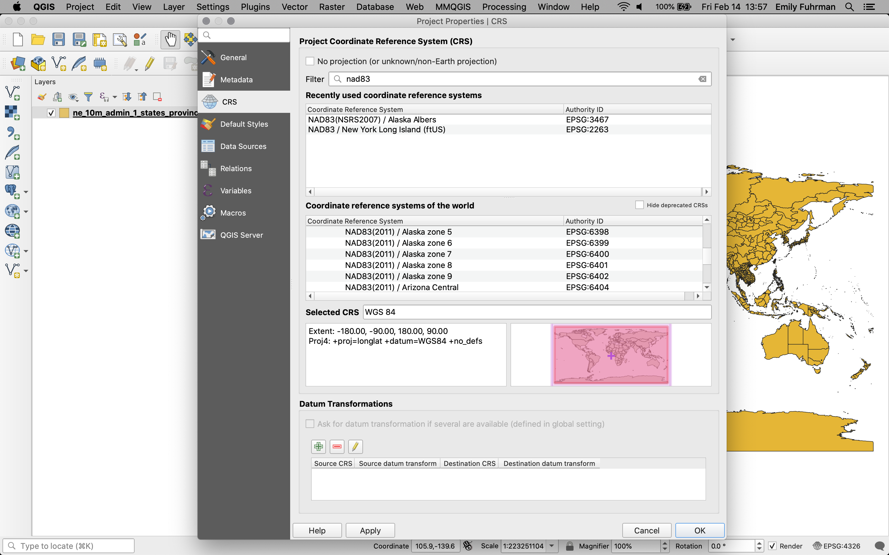

Two datasets that were originally referenced to different datums, but which are then rendered in the same projection, will not line up.

#### Projection
A projection, or Coordinate Reference System (CRS), is used to describe geographic data. A projection is the set of transformations that converts a series of geographic coordinates, which are locations on a curved surface (the datum), into locations on a flat surface.

### Creating a thematic population map of the U.S.
#### Downloading Census state population data
The Natural Earth state boundaries will serve as the 'empty' geography files for this project, to which we will join both U.S. Census state area measurements and U.S. Census population counts. We will be mapping the population density for each U.S. state, and will therefore need the area of each state, as well as the number of people who live in each state.

To download the data for this project, we will be returning again to the [Census Data Portal](https://data.census.gov/cedsci/). Navigate to the portal and click the `Advanced Search` option. Here we will select the following parameters within the `Topics` and `Geography` levels:

* `Topics` > `Populations and People` > `Populations and People`
* `Geography` > `State` > `All States in United States`
* `Surveys` > `PEP Population Estimates`
* `Years` > `2019`

To filter the available datasets, do the following:
* On the left side of the `Advanced Search` window, and open up the `Topics` tab. Click the `Populations and People` section, and select `Populations and People`.
* Next, open up the `Geography` tab, and select `State` from the dropdown menu. Select `All States in United States`.
* Next, open up the `Surveys` tab. Select `PEP Population Estimates`.
* Finally, open up the `Years` tab. Select `2019`.

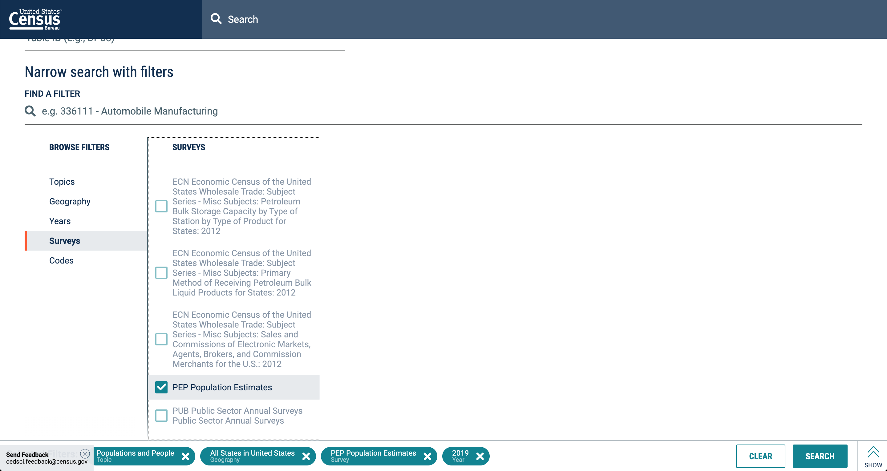

Once you have selected each of the above parameters, click `Search`.

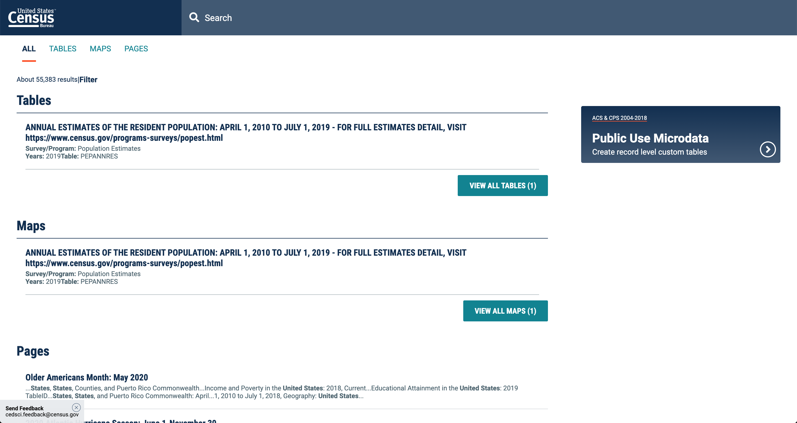 

Click the first entry to navigate to the table. This view should include a column listing the full name of every U.S. state, and entries for each state containing population estimates for 2012, 2013, 2014, 2015, 2016, 2017, 2018, and 2019. Before downloading, we will filter this view to make sure we only pull the values we need (2019 population estimates).

In the table view, click `Filter` to open a right panel. First, go to the `Columns` tab and make sure that both `Geography` and `Estimate Date` is checked.

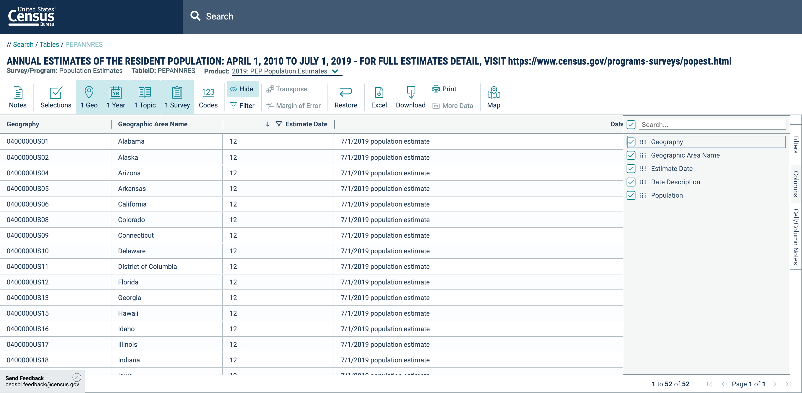 

Next, go to the `Filters` tab. Select `Estimate Date`. Choose `Greater than or equals`, and set the value to `11`. This will filter out all population estimate years except for the one we want, 2019. 

To download the data in CSV format, click the `Excel` button in the top bar. 

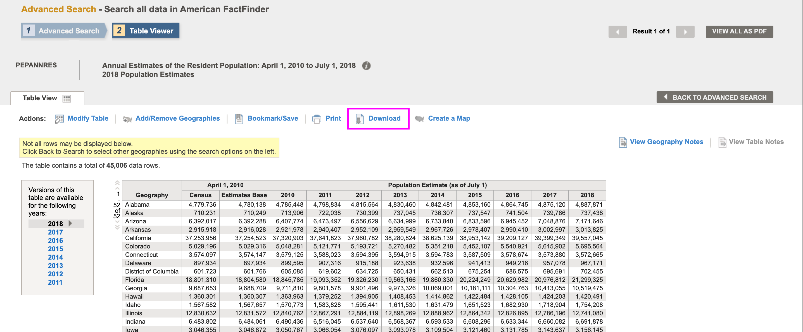

Click `Export to CSV`. The downloaded file will be named something like `PEPPOP2019.PEPANNRES-2021-02-04T174743` (note that the metadata after the `.` includes the date and time downloaded).

#### Transforming Census state population data
As always, there are many possible ways to transform data to fit the needs of your project. For this tutorial we will be working in Excel, or Google Sheets, to make the original file more manageable. We will reduce the dataset down to only the values we need, and then create a new column that will enable us to join the data to the Natural Earth shapefile.

* Open up the CSV (`PEPPOP2019.PEPANNRES-2021-02-04T174743.csv`). The file should look something like this:

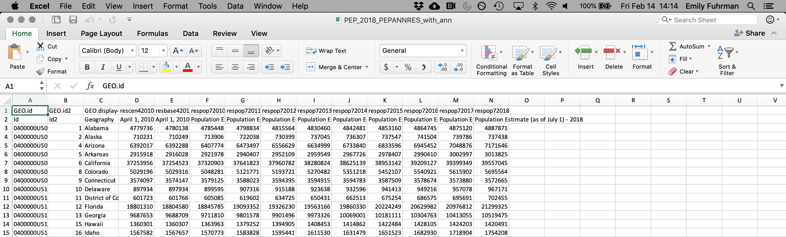

* In order to create our map, the only data we need is state name, state ID, and population count. 
	* To narrow the dataset down to only these values, delete every column *except* for `Geography (GEO_ID)`, `Geographic Area Name (NAME)`, and the last column on the right, `Population (POP)`.

	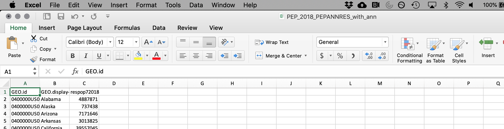

	* Rename the columns to `ID`, `Name`, and `Population`.

* We will be using [FIPS region codes](https://en.wikipedia.org/wiki/List_of_FIPS_region_codes_(S%E2%80%93U)#US:_United_States) to join the Natural Earth vector boundaries with the Census population data. The value in the `ID` column is a concatenated string that combines the Census table ID with individual state FIPS codes. We need to separate out the FIPS code portion of this ID so that this dataset can match up with the Natural Earth dataset, which already uses FIPS codes to identify each state. To do that, we need to create a new column that pulls *only the last four characters* in the `ID` column. We will use the `Right` function in Excel to do this.
	* Create a new column in Excel, and name it `FIPS_ID`.
	* In the first cell of the column, type the formula `=RIGHT(A2,4)`. This will pull the last four characters in the `ID` column, `A2`, into the new `FIPS_ID` column.

	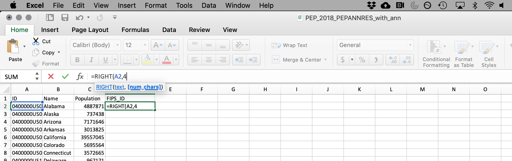

	* After typing the formula, hit `Enter`. Double-click on the bottom right corner of the cell to populate the entire column with the new formula.

	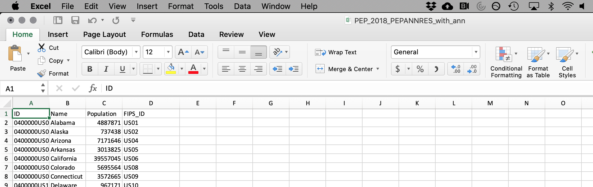
	
	* Name the file `StatePopulations.csv`, and save it to CSV format.

	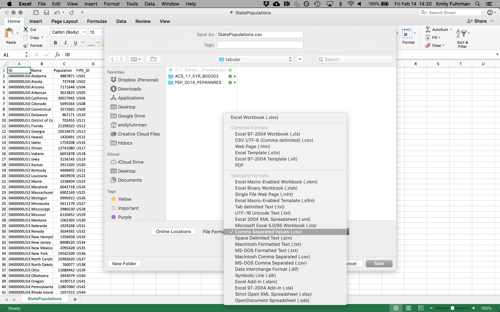

* As in Tutorial 03, we need to create a file that describes the data types in this new CSV before attempting to import it into QGIS. We will therefore use a text editor to create a `.csvt` file.
	* In your text editor of choice, open a new file.
	* In our CSV file, every column except for `Population` is a string. We therefore want to type, in order, `"String", "String", "Integer", "String"`.
	* Save the file with the same name as the CSV file, only with the `.csvt` extension: `StatePopulations.csvt`. It should look something like this:

	

* Now we are ready to bring all of the data together in QGIS.

#### Re-projecting selected features from the Natural Earth dataset
We will begin by importing the Natural Earth boundary data into a new QGIS project. Because we are creating a thematic map of the United States, we only need the portions of the Natural Earth shapefile that represent U.S. administrative boundaries. We will isolate these areas, join them to corresponding TIGER state boundary data, and then re-project them to a projection more suitable for a U.S.-specific thematic map. 

* Open up a new project in QGIS and add the Natural Earth states and provinces data. The data is referenced to the WGS84 datum, which we can see by navigating to the `Source` section under `Layer Properties`. The definition for the layer's projection is under `Geometry and Coordinate Reference System`.

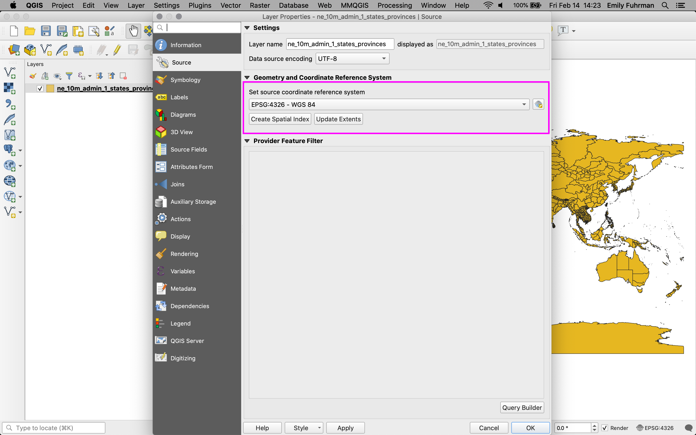

* Since we are creating a map of the United States, the next step is to select all states and provinces that fall within U.S. administrative boundaries. Open up the attribute table for the states and provinces layer, click the `Select features using an expression` option, and build a query to select all features for which the `admin` value is equal to `United States of America`.

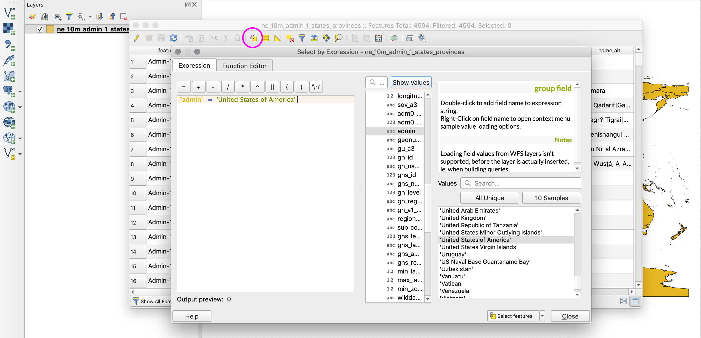

* Hit `Select` and close the query builder. Navigating back to the map, only the U.S. should be selected.

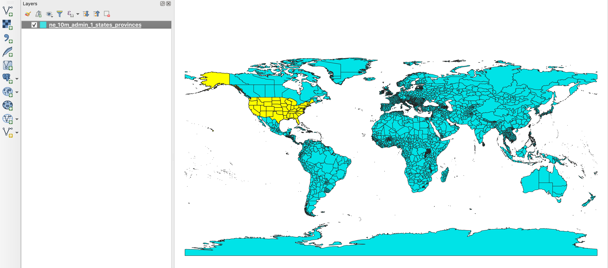

* Now, we want to re-project the United States to the Albers equal-area conic projection. The Albers projection is a popular choice for thematic maps of the U.S. Right-click the states and provinces layer, choose `Export > Save Selected Features As...`, choose `ESRI Shapefile`, and select `North_America_Albers_Equal_Area_Conic (ESPG:102008)` as the CRS. You may have to search for the specific projection by clicking on the small square icon next to the `CRS` dropdown menu.

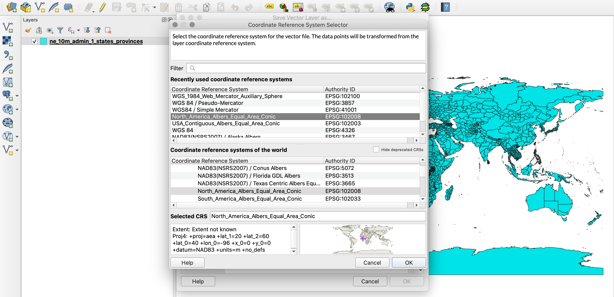

* Name the file `US_States_Albers`. Make sure to check the `Save only selected features` option, and hit `OK`.
* When added to your current project, the new layer will keep its current project. As a result of this, you probably see the new layer fill up the whole screen.  
* Click the button in the bottom left corner to manually update your project CRS to the same projection as the new layer, `North_America_Albers_Equal_Area_Conic (ESPG:102008)`.
* Hide or delete the states and provinces layer.  
* Open up the layer properties for `US_States_Albers` and navigate to the `Information` tab. You should see either `ESPG:102008` or `USER:#` as the projection associated with this layer. (If you see a `USER` string, QGIS interpreted this as a custom, user-added projection. It should be equivalent to the one you selected.)

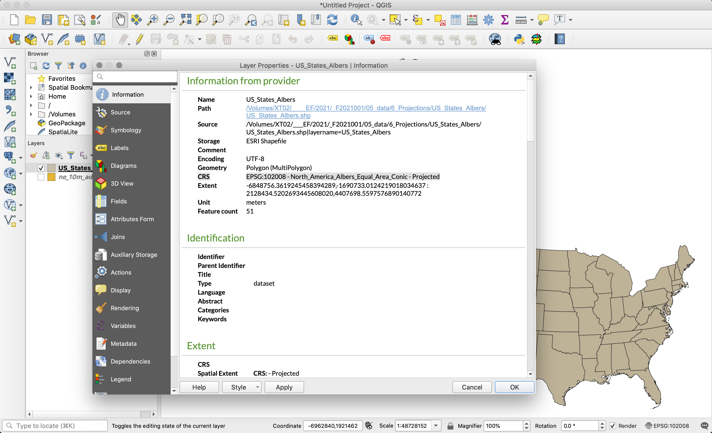

#### Preparing the U.S. Albers layer for joins

We need to create a new column in the attribute table of this layer to prepare it to be joined to the TIGER layer. Though we are using the aforementioned FIPS codes for each of these joins, sometimes the codes are represented in different forms. In both the `US_States_Albers` layer and our downloaded CSV, the FIPS code is formatted in the following way: `US##`. In the TIGER shapefile, however, the FIPS code is located in a column labeled `STATEFP`, and is formatted without `US` in the front of the value: `##`. To facilitate our upcoming join, we will create a new column in the `US_States_Albers` layer with only the `##` part of the `US##` value. 

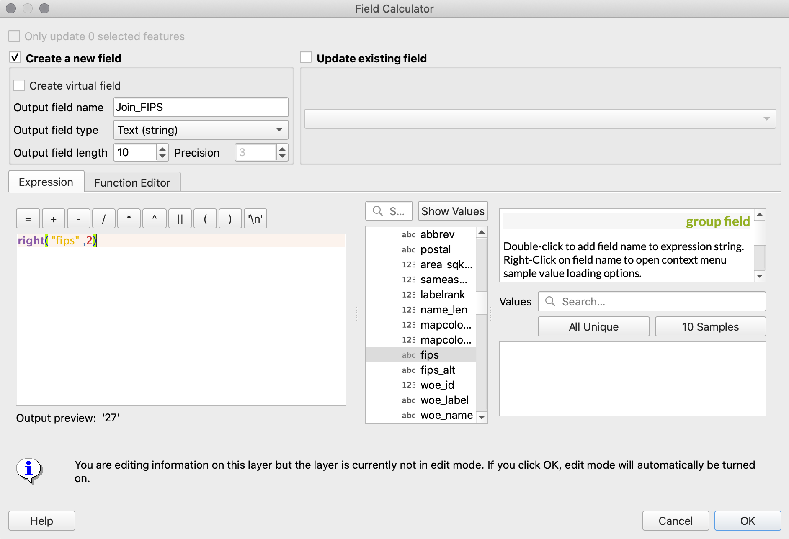

* Open up the attribute table for the `US_States_Albers` layer.
* Click the abacus icon to open up the field calculator window.
* Check `Create a new field`.
* In `Output field name`, enter `Join_FIPS`.
* In `Output field type`, enter `Text (string)`.
* In the `Expression` window, navigate to the `String` section in the middle panel, and select the `right` function. This will act in the same way as the function we entered in Excel. As explicated in the right panel, this function takes two values: the first is a string, and the second is a number specifying the number of characters to extract from the right side of the string. Our string will be the `STATEFP` column, and the number of characters will be `2`. This will enable us to create a new column wherein the FIPS ID, `US##`, will be represented as `##`.
* Open the `Fields and values` section in the middle panel, and select `fips`. This will be the first value for the `right` function.
* Next, type a comma (`,`), the number `2`, and a closing parenthesis (`)`). This tells the `right` function to represent only the last two digits of the value from the `fips` column. Your `Output preview` at the bottom should represent a two-digit number. Click `OK`. A new column containing the reformatted FIPS values will now appear on the far right end of your attribute table.
* Before closing the attribute table, deselect the pencil icon in the top left corner to stop editing the shapefile. Click `Save` when prompted to save your changes.

#### Joining the TIGER shapefile to the U.S. Albers layer
Natural Earth data does not contain official state area measurements, but the TIGER state boundaries do. On top of your newly projected `US_States_Albers` layer, add the `tl_2019_us_state` TIGER shapefile as a new vector layer. It should automatically adopt the Albers projection. If you open up the attribute table for the TIGER boundaries, you will see the columns `ALAND` and `AWATER`, which are the land and water areas in square meters for each polygon. These are the values that the Natural Earth dataset lacks. The attribute table should also include a column labeled `STATEFP`, which is the one to which we will join our reformatted FIPS column. We are now ready to connect the TIGER shapefile to the `US_States_Albers` layer. 

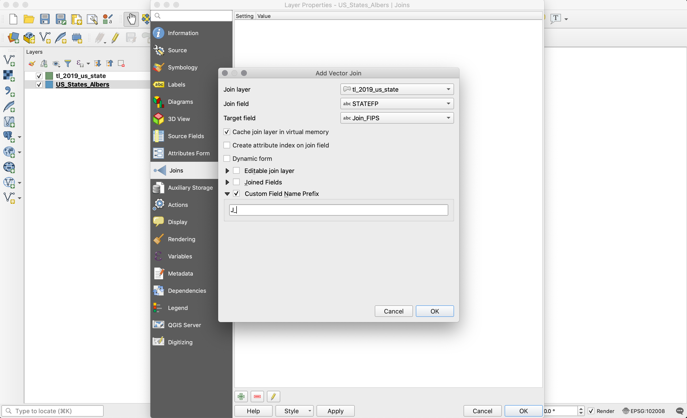

* Open up the `Properties` panel for the `US_States_Albers` layer. 
* In the left menu, select `Joins`.
* Click the green `+` at the bottom of the window.
* Under `Join layer`, select `tl_2019_us_state`.
* Under `Join field`, select `STATEFP`.
* Under `Target field`, select `Join_FIPS`, our reformatted FIPS column.
* Check `Custom field name prefix`, and enter `J_`. 
* Click `OK`.

Open up the attribute table on the `US_States_Albers` layer. At the far right, after `Join_FIPS`, you should now see a series of additional columns, each prefaced with `J_`. These should include `J_ALAND` and `J_AWATER`, the area measurements of each state. Success! Go ahead and hide the TIGER shapefile layer.

#### Joining Census data to Natural Earth boundaries
Now that the `US_States_Albers` layer is ready, we can import the CSV file and join population values to each state. 
* Click the top `Layer` menu, navigate to `Add Layer`, and select `Add Delimited Text Layer...`.
* Select the previously-saved `StatePopulations.csv` file.
* Click the `No geometry (attribute only table)` option.
* Ensure the data looks correctly formatted, and click `Add`.

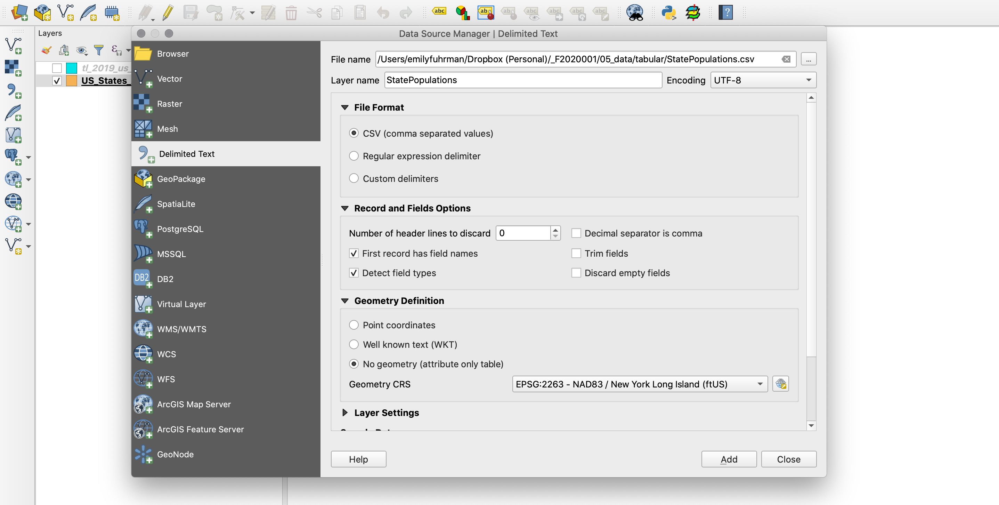

* Now, double-click on the `US_States_Albers` layer to bring up the `Layer Properties` panel.
* Navigate again to the `Joins` section. Your previous join to the TIGER shapefile should be listed.
* Click the `+` button at the bottom of the window to add a new join.
* Select `StatePopulations`, your imported CSV file, as the join layer.
* Select `FIPS_ID` as the `Join field`, which is the column name for the FIPS ID in the CSV file.
* Select `fips` as the `Target field`, which is the column name for the FIPS ID in the `US_States_Albers` layer.
* If you like, create a short `Custom field name prefix` to differentiate your joined columns from the original ones.

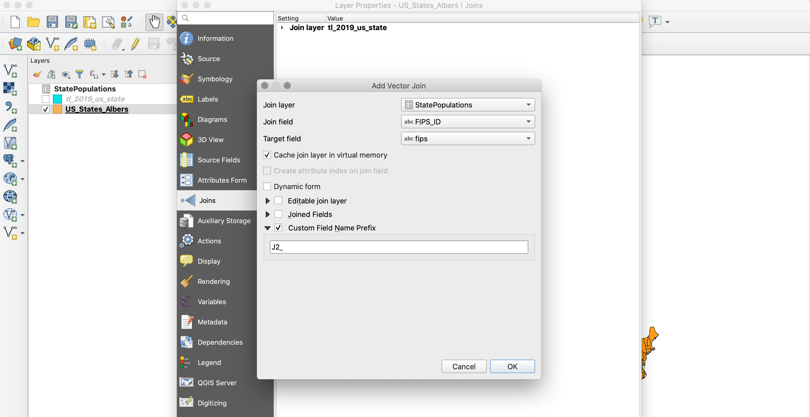

* Click `OK`.
* Exit the `Layer Properties` panel, and open up the attribute table for the `US_States_Albers` layer. Confirm that three additional fields were added to the end.
* We now need to save the `US_States_Albers` layer as a new shapefile in order to retain the join. Right-click on the layer, choose `Export > Save Features As...`, and name it `US_States_Albers_JOINED`. Make sure the selected CRS is still `North_America_Albers_Equal_Area_Conic (ESPG:102008)`, and keep `Add saved file to map` checked. Click `OK`. 

#### Representing population data
For our final print export, we will be creating a choropleth map that represents population density for each state. Now that we have joined the `US_States_Albers` layer to the Census data, we need to derive one more column that represents the population per km2 for the land area of each polygon.

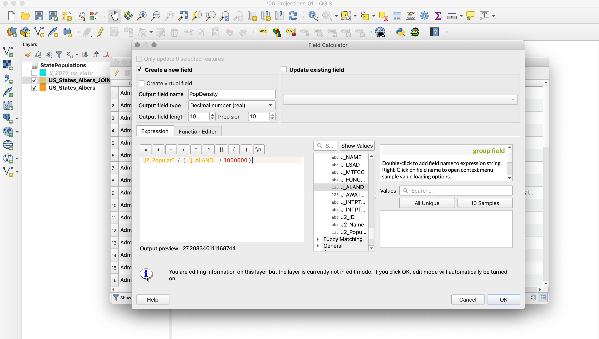

* Open up the attribute table for the `US_States_Albers_JOINED` layer. 
* Click the abacus icon to open up the field calculator window.
* Check `Create new field`.
* For `Output field name`, enter `PopDensity`.
* For `Output field type`, select `Decimal number (real)`.
* For `Output field length`, select `10`, and set `Precision` to `10` as well.
* In the `Expression` field, we want to calculate the number of people per km2. Navigate to `Fields and values` in the center panel, and double click the joined population value, which should be at the very end of the list. Because I chose `J2` as my join prefix, this value is `J2_Populat` for me.
* Click the `/` operator.
* Navigate again to the `Fields and values` section in the center panel, and double click the land area value. For me, this is `J_ALAND`, since I chose `J` as my join prefix.
* Since `J_ALAND` is in m2, but I want to calculate population density based on km2, I need to divide this value by 1000000. Enclose `J_ALAND` in parenthesis and add `/ 1000000`.
* Your final expression should read `"J2_Populat" / ( "J_ALAND" / 1000000 )`.
* Save your changes, and unclick the pencil icon to stop editing the shapefile.

Before visualizing our data, we need to filter out Washington D.C. so as not to skew our scale. Open the `Layer Properties` for `US_States_Albers_JOINED`, and navigate to the `Source` tab. Click `Query Builder` in the bottom right hand corner. Type `"adm1_code" != 'USA-3556'` to show all polygons that do not have the Washington D.C. `adm1_code`, `USA-3556`. Click `OK`.

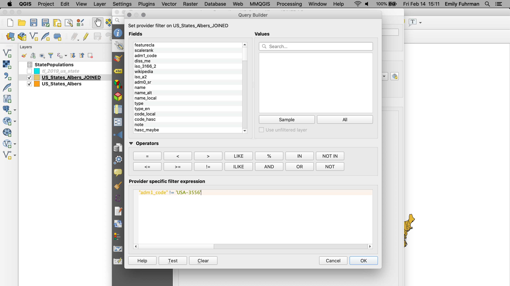

Now, we are ready to apply a color scale to this column. Navigate to the `US_States_Albers_JOINED` `Layer Properties` panel, and selecting a graduated color scale for your new `PopDensity` column. Set your number of classes to `8`. Try a few different classification methods, and notice how they differ in output. Coose the `Natural Breaks (Jenks)` option. Your map should look something like this:

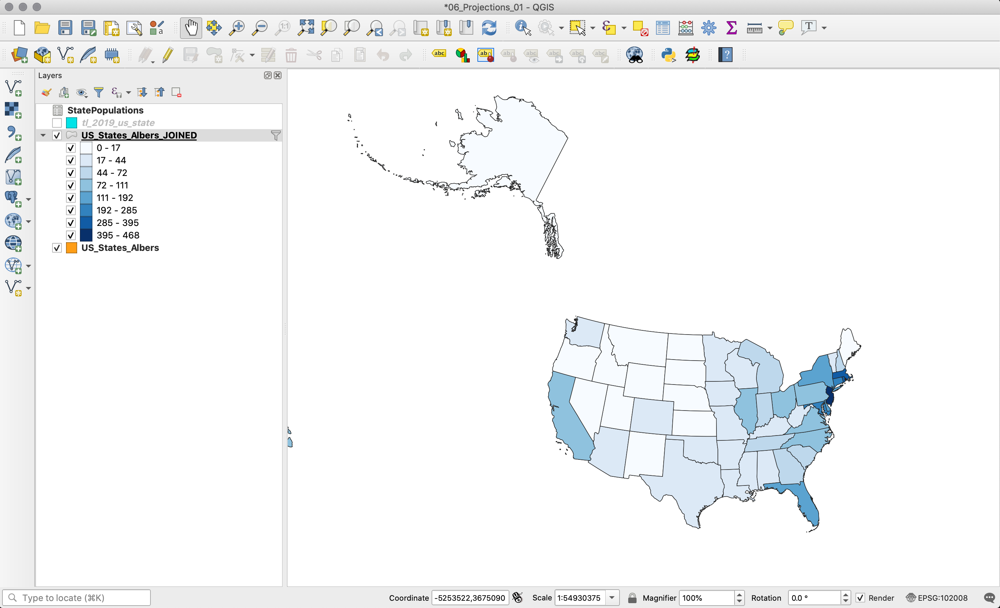

Once you are finished with this step, adjust colors and strokes as needed. Finally, create a new print composer. Add a legend, title, explanation, source, and scale bar. Manipulate the `Scale` field for the map to only show the contiguous U.S. Add new layers for Alaska and Hawaii to approach a more traditional Albers view, and make sure to include a scale bar for each one so as to be transparent about any distortion. Export your map as a PDF file. Your final map should look something like this:

#### Deliverables
Upload your final (PDF) map to Canvas.

#### Additional notes
[Here](https://medium.com/@joshuatauberer/how-that-map-you-saw-on-538-under-represents-minorities-by-half-and-other-reasons-to-consider-a-4a98f89cbbb1#.ih16rv26m) is an excellent piece on how choropleth maps underrepresent minorities.

______________________________________________________________________________________________________________

Tutorial created by Emily Fuhrman for the Mapping for Architecture, Urbanism and the Humanities class at Columbia University. Edited by Brian House for Fall 2018 and Emily Fuhrman for Spring 2021.

